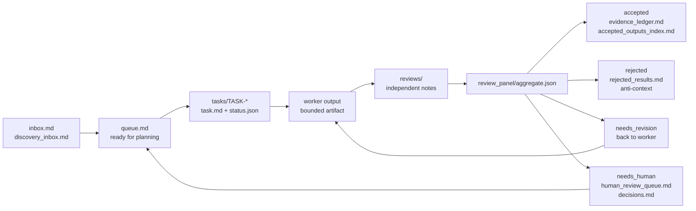

# Async Research Workflow

Alpha Python CLI and starter workspace for low-cost asynchronous research loops.

`async-research` gives a solo researcher or small team a file-backed operating
system for slow, reviewable research work. It does not run LLMs by itself.
Instead, it gives humans, Codex jobs, and scheduled agents a shared
`research_ops/` workspace with queues, task folders, source governance, review
gates, cost logs, health checks, and accepted-evidence memory.

The design goal is simple: move one bounded research task at a time from idea to
accepted evidence, rejected result, revision, or human decision without relying
on chat history as the source of truth.

Runtime dependencies are standard-library-only. Python 3.11 or newer is
required.

## Status

Version `0.1.0a1` is a visible alpha. The core safety and package-resource
checks are green, but the public user experience is still being hardened. Treat
the CLI as suitable for careful dogfooding, not broad promotion.

The package is currently intended for GitHub install and real-project testing
before PyPI publication.

## How The Loop Works

The workflow is a durable research conveyor belt. Agents and humans read and
write files in `research_ops/`; CLI commands validate those files and keep the
control surfaces current.



Plain English version:

1. Ideas enter `inbox.md` or `discovery_inbox.md`.
2. A planner turns the best idea into a bounded task folder under
   `research_ops/tasks/`.
3. A worker claims one task, writes one output, and updates task state.
4. One or more reviewers write isolated reviews.
5. The review aggregator routes the task to accepted, rejected, needs revision,
   or needs human.
6. Accepted results become reusable memory; stale accepted memory is surfaced for
   revalidation.
7. Health, readiness, cost, source, and human-review surfaces keep the next loop
   safe to run.

## Install

Install directly from GitHub:

```bash
python3 -m venv .venv
. .venv/bin/activate
python -m pip install --upgrade pip
python -m pip install git+https://github.com/dzianissokalau/async-research.git
async-research version
```

For development on this package:

```bash
git clone https://github.com/dzianissokalau/async-research
cd async-research
python3 -m venv .venv
. .venv/bin/activate
python -m pip install --upgrade pip
python -m pip install -e .
async-research version
```

## Start A Workspace

Run these commands from the research repo where you want `research_ops/` to
live:

```bash
async-research init research_ops
async-research schema-check research_ops
async-research readiness research_ops --dry-run
async-research health research_ops --dry-run
async-research surface update research_ops
async-research surface validate research_ops
```

The default starter is generic and domain-neutral. It creates the operational
files and empty task/review/discovery folders, but no live seed tasks and no
precomputed health report.

To initialize the real-estate worked example instead:

```bash
async-research init research_ops --template real-estate
```

Use `--force` only when you deliberately want to replace an existing target.
Non-forced `init` and `starter-smoke` refuse existing non-empty directories.

## What Gets Created

The starter workspace is intentionally file-backed:

```text
research_ops/
  README.md
  inbox.md
  discovery_inbox.md
  queue.md
  daily_status.md
  weekly_digest.md
  human_review_queue.md
  decisions.md
  data_source_audit.md
  evidence_ledger.md
  accepted_outputs_index.md
  rejected_results.md
  result_acceptance_policy.md
  escalation_policy.md
  cost_ledger.csv
  metrics_baseline.json
  metrics_history.jsonl
  revalidation_schedule.md
  discovery/
  review_panel/
  batches/
  tasks/
```

The important rule is that durable state lives in files. Agents should not rely
on private chat context to know what happened before.

## Worked Task Loop

The generic starter does not create a task for you. A human, planner, or agent
creates a task folder such as:

```text
research_ops/tasks/TASK-0001-example/
  task.md
  status.json
  worker_output.md
  reviews/
    primary.md
  review_panel/
```

The task files must follow the schemas and task contracts in the packaged docs.
Once a task exists, a typical loop is:

```bash
TASK=research_ops/tasks/TASK-0001-example

async-research schema-check research_ops
async-research readiness research_ops --dry-run

# Worker writes worker_output.md and updates status.json according to the task contract.
# Reviewer writes reviews/primary.md, or a full panel writes one isolated review each.

async-research review aggregate "$TASK" --dry-run
async-research review aggregate "$TASK"
async-research accepted update research_ops
async-research accepted revalidation research_ops --write-schedule
async-research surface update research_ops
async-research surface validate research_ops
async-research health research_ops
```

When aggregation routes a task to `accepted` or `rejected`, the aggregator also
validates result acceptance. Accepted results are written to
`evidence_ledger.md`; rejected results are written to `rejected_results.md`.
Running `accepted update` refreshes `accepted_outputs_index.md`, which future
agents use as reusable but freshness-gated memory.

If the aggregate routes to `needs_revision`, send the task back to a bounded
worker. If it routes to `needs_human`, update the surface and record the decision
in `decisions.md` before continuing autonomous work.

For a populated example task set, initialize the real-estate worked example with
`--template real-estate` and inspect its `tasks/` folders.

## Command Map

Most commands print JSON. Commands that mutate files should be run with
`--dry-run` first when that option is available.

| Command | Use | Reads | Writes |
| --- | --- | --- | --- |
| `async-research version` | Confirm the installed CLI version. | Package metadata. | JSON to stdout. |
| `async-research init research_ops` | Create a starter workspace. | Packaged starter template. | `research_ops/`, metrics baseline/history files. |
| `async-research starter-smoke /tmp/arw --force` | Initialize and validate a disposable starter. | Packaged starter, schemas, benchmark cases. | The target smoke directory; refuses existing non-empty targets without `--force`. |
| `async-research schema-check research_ops` | Validate schema versions for workflow JSON artifacts. | Task status files and other versioned JSON artifacts. | JSON to stdout only. |
| `async-research readiness research_ops --dry-run` | Decide whether another autonomous loop is safe. | Queue, task status, locks, source audit, accepted memory, cost, metrics, health state. | With `--dry-run`, stdout only. Without it, `health_report.json` and `daily_status.md`. |
| `async-research health research_ops --dry-run` | Produce operational health status. | Queue, task status, locks, review state, cost, metrics, accepted memory. | With `--dry-run`, stdout only. Without it, `health_report.json` and `daily_status.md`. |
| `async-research surface update research_ops` | Refresh the human-facing control surface. | Task status, health report, ledgers, cost, accepted memory. | `daily_status.md`, `human_review_queue.md`, `weekly_digest.md`. |
| `async-research surface validate research_ops` | Check the rendered human surface for drift. | `daily_status.md`, `human_review_queue.md`, `weekly_digest.md`, current workspace state. | JSON to stdout only. |
| `async-research source validate research_ops` | Validate the source audit register. | `data_source_audit.md`. | JSON to stdout only. |
| `async-research source freshness research_ops` | Report stale or due source reviews. | `data_source_audit.md`. | JSON to stdout only. |
| `async-research cost summary research_ops` | Summarize spend and budget pressure. | `cost_ledger.csv`. | JSON to stdout only. |
| `async-research metrics append research_ops --label manual` | Append an autonomy metrics snapshot. | Health, task, review, accepted-memory, and cost files. | `metrics_history.jsonl`; optionally `weekly_digest.md`. |
| `async-research review aggregate <task-dir>` | Combine isolated reviews and route a task. | `status.json`, `reviews/*.md`, worker output, review policy. | `review_panel/aggregate.json`, `review_panel/aggregate.md`, `status.json`, and accepted/rejected ledgers for final routes. |
| `async-research result-acceptance <task-dir> --ops-dir research_ops --write --update-ledgers` | Validate or write final result acceptance for a reviewed task. | Task status, worker output, review aggregate, source audit, accepted memory. | `review_panel/result_acceptance.json`; with ledgers, `evidence_ledger.md` or `rejected_results.md`. |
| `async-research accepted update research_ops` | Refresh reusable accepted-memory index rows. | Accepted task records and evidence ledger. | `accepted_outputs_index.md`. |
| `async-research accepted revalidation research_ops --write-schedule` | Surface due or stale accepted memory. | `accepted_outputs_index.md`. | `revalidation_schedule.md` when `--write-schedule` is set. |
| `async-research benchmark` | Run known-good and known-bad autonomy cases. | Packaged benchmark cases and runtime resources. | Isolated temporary fixtures and JSON to stdout. |
| `async-research acceptance-suite` | Run the package hardening suite. | Packaged resources and isolated fixtures. | Isolated temporary fixtures and JSON to stdout. |
| `async-research simulate-week research_ops` | Rehearse a scheduled week against an isolated copy. | The provided `research_ops/` workspace. | Temporary simulation copy and JSON to stdout. |

Validator commands for specific artifact types are also available:

```bash
async-research exploration validate <worker-output> --ops-dir research_ops --task-dir <task-dir>
async-research idea score <idea-json> --ops-dir research_ops
async-research idea validate <idea-json> --ops-dir research_ops
async-research experiment validate <worker-output> --ops-dir research_ops --task-dir <task-dir>
```

## Core Checks For Maintainers

From this package repo, run:

```bash
.venv/bin/python -m unittest discover -s tests
.venv/bin/async-research acceptance-suite
.venv/bin/async-research benchmark
.venv/bin/async-research starter-smoke /tmp/async-research-starter-generic --force
.venv/bin/async-research starter-smoke /tmp/async-research-starter-real-estate --template real-estate --force
.venv/bin/python -m compileall src tests
```

Packaging-aware CI also builds wheel and sdist, installs the built wheel into a
clean environment, and reruns installed CLI smokes.

## Where To Read Next

- [Package docs index](src/async_research_workflow/docs/README.md)
- [Workflow blueprint](src/async_research_workflow/docs/workflow_blueprint.md)
- [Task contracts](src/async_research_workflow/docs/task_contracts.md)
- [Operational readiness runbook](src/async_research_workflow/docs/operational_readiness_runbook.md)
- [Generic starter README](src/async_research_workflow/templates/generic_research_ops_starter/research_ops/README.md)
- [Real-estate worked example README](src/async_research_workflow/templates/research_ops_starter/research_ops/README.md)
- [Roadmap](ROADMAP.md)

## Operating Principles

- Keep work small, bounded, and reviewable.
- Treat `research_ops/` files as the shared memory.
- Run readiness before starting expensive or unattended work.
- Keep source and accepted-memory freshness gates fail-closed.
- Prefer accepted evidence per dollar over agent activity for its own sake.
