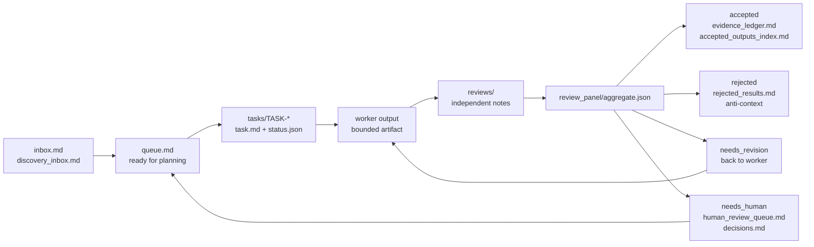

# Async Research Workflow

Alpha Python CLI and starter workspace for low-cost asynchronous research loops.

`async-research` gives a solo researcher or small team a file-backed operating
system for slow, reviewable research work. It does not run LLMs by itself.
Instead, it gives humans, Codex jobs, and scheduled agents a shared
`research_ops/` workspace with queues, task folders, source governance, review
gates, cost logs, health checks, and accepted-evidence memory.

The design goal is simple: move one bounded research task at a time from idea to
accepted evidence, rejected result, revision, or human decision without relying
on chat history as the source of truth.

Runtime dependencies are standard-library-only. Python 3.11 or newer is
required.

## Status

Version `0.2.0a5` is a visible alpha with the durable Idea Catalog, promotion
write mode, data-foundation readiness surfaces, Knowledge Library / Research
Foundations surfaces, hypothesis-testing contracts, and local operator
dashboard included. The core safety, package-resource, and dashboard hardening
checks are green. Treat the CLI as suitable for careful dogfooding, not broad
promotion.

The package is currently intended for GitHub install and real-project testing
before PyPI publication.

## How The Loop Works

The workflow is a durable research conveyor belt. Agents and humans read and
write files in `research_ops/`; CLI commands validate those files and keep the
control surfaces current.



Plain English version:

1. Ideas enter `inbox.md` or `discovery_inbox.md`.
2. A planner turns the best idea into a bounded task folder under
   `research_ops/tasks/`.
3. A worker claims one task, writes one output, and updates task state.
4. One or more reviewers write isolated reviews.
5. The review aggregator routes the task to accepted, rejected, needs revision,
   or needs human.
6. Accepted results become reusable memory; stale accepted memory is surfaced for
   revalidation.
7. Health, readiness, cost, source, and human-review surfaces keep the next loop
   safe to run.

## Install

Install directly from GitHub:

```bash
python3 -m venv .venv
. .venv/bin/activate
python -m pip install --upgrade pip
python -m pip install git+https://github.com/dzianissokalau/async-research.git
async-research version
```

For development on this package:

```bash
git clone https://github.com/dzianissokalau/async-research
cd async-research
python3 -m venv .venv
. .venv/bin/activate
python -m pip install --upgrade pip setuptools
python -m pip install -e .
async-research version
```

## Start A Workspace

Run these commands from the research repo where you want `research_ops/` to
live:

```bash
async-research init research_ops
async-research schema-check research_ops
async-research readiness research_ops --dry-run
async-research health research_ops --dry-run
async-research surface update research_ops
async-research surface validate research_ops
```

The default starter is generic and domain-neutral. It creates the operational
files and empty task/review/discovery folders, but no live seed tasks and no
precomputed health report.

To initialize the real-estate worked example instead:

```bash
async-research init research_ops --template real-estate
```

Use `--force` only when you deliberately want to replace an existing target.
Non-forced `init` and `starter-smoke` refuse existing non-empty directories.
`starter-smoke` prints one JSON envelope containing the initializer result and
the smoke-check result so CI, dashboards, and LLM reviewers can parse a single
document.

For the shortest first operator pass after setup, use the packaged
[First Success Quickstart](src/async_research_workflow/docs/first_success_quickstart.md).

## What Gets Created

The starter workspace is intentionally file-backed:

```text
research_ops/
  README.md
  inbox.md
  discovery_inbox.md
  ideas/
    idea_catalog.md
    prioritization.md
  library/
    source_library.md
    knowledge_index.md
    claim_map.md
    method_index.md
    open_questions.md
    library_update_log.md
  data/
    data_catalog.md
    data_access.md
    join_map.md
    known_data_gaps.md
    profiles/
      README.md
  queue.md
  daily_status.md
  weekly_digest.md
  human_review_queue.md
  decisions.md
  data_source_audit.md
  evidence_ledger.md
  accepted_outputs_index.md
  rejected_results.md
  result_acceptance_policy.md
  escalation_policy.md
  cost_ledger.csv
  metrics_baseline.json
  metrics_history.jsonl
  revalidation_schedule.md
  discovery/
  review_panel/
  batches/
  tasks/
```

The important rule is that durable state lives in files. Agents should not rely
on private chat context to know what happened before. `data_source_audit.md`
remains the source-governance register; `data/` holds the human-readable
readiness inventory, access notes, join map, gaps, and profile contract.

The canonical library path is `research_ops/library/`. `library/` is separate
from accepted-output memory. It stores durable background context: `LIT-*`
source identities, topic summaries, claim caveats, methods, and open questions.
`LIT-*` source identities live in `library/source_library.md`.
`accepted_outputs_index.md` stores reviewed task results that can be reused with
freshness checks. A `LIT-*` library reference can support planning or review
context, but final accepted claims still need source-level citation and review.

## Worked Task Loop

The generic starter does not create a task for you. A human, planner, or agent
creates a task folder such as:

```text
research_ops/tasks/TASK-0001-example/
  task.md
  status.json
  worker_output.md
  reviews/
    primary.md
  review_panel/
```

The task files must follow the schemas and task contracts in the packaged docs.
Once a task exists, a typical loop is:

```bash
TASK=research_ops/tasks/TASK-0001-example

async-research queue list research_ops
async-research workflow next research_ops
async-research workflow status "$TASK"
async-research workflow worker-start "$TASK" --dry-run
async-research workflow worker-start "$TASK"
# write "$TASK/worker_output.md"
async-research workflow worker-complete "$TASK" --dry-run
async-research workflow worker-complete "$TASK"
# submit required reviews shown by workflow status
async-research workflow advance "$TASK" --dry-run
async-research workflow advance "$TASK"
```

The orchestrator preserves the individual command contracts and reports each
subcommand, exit code, stdout JSON, and next step. The equivalent manual loop is:

```bash
TASK=research_ops/tasks/TASK-0001-example

async-research schema-check research_ops
async-research readiness research_ops --dry-run

# Worker writes worker_output.md and updates status.json to awaiting_review.
# Before aggregation, status.json must record the review-start transition:
# awaiting_review -> single_review for primary review, or awaiting_review -> panel_review for panel review.
# Reviewer writes reviews/primary.md, or a full panel writes one isolated review each.
# Use draft for a safe scaffold, or submit for an explicit role-specific decision.

async-research review draft "$TASK" --role primary
async-research review submit "$TASK" --role primary --decision needs_human --claim-strength none --confidence 0.5
async-research review aggregate "$TASK" --dry-run
async-research review aggregate "$TASK"
async-research accepted update research_ops
async-research accepted revalidation research_ops --write-schedule
async-research surface update research_ops
async-research surface validate research_ops
async-research health research_ops
```

When aggregation routes a task to `accepted` or `rejected`, the aggregator also
validates result acceptance. Accepted results are written to
`evidence_ledger.md`; rejected results are written to `rejected_results.md`.
Running `accepted update` refreshes `accepted_outputs_index.md`, which future
agents use as reusable but freshness-gated memory.

The review-start transition is intentionally explicit. If reviews exist while a
task still says `awaiting_review`, `review aggregate` fails closed and returns a
`suggested_intermediate_status` plus `next_step` so a human or agent can record
the missing `single_review` or `panel_review` state before rerunning aggregation.
To avoid hand-editing `status.json`, rerun the same command with
`--record-review-start`; the helper validates the intermediate review-start
transition before applying the aggregate route.

If the aggregate routes to `needs_revision`, send the task back to a bounded
worker. If it routes to `needs_human`, update the surface and record the decision
in `decisions.md` before continuing autonomous work.

For a populated example task set, initialize the real-estate worked example with
`--template real-estate` and inspect its `tasks/` folders.

## Command Map

Most commands print JSON. Commands that mutate files should be run with
`--dry-run` first when that option is available.

The original command names remain canonical for scripts and docs. Two additive
readability aliases are also available: `review-surface` is an alias for
`surface`, and `accepted revalidate` is an alias for `accepted revalidation`.

| Command | Use | Reads | Writes |
| --- | --- | --- | --- |
| `async-research version` | Confirm the installed CLI version. | Package metadata. | JSON to stdout. |
| `async-research init research_ops` | Create a starter workspace. | Packaged starter template. | `research_ops/`, metrics baseline/history files. |
| `async-research starter-smoke /tmp/arw --force` | Initialize and validate a disposable starter. | Packaged starter, schemas, benchmark cases. | The target smoke directory; refuses existing non-empty targets without `--force`. |
| `async-research schema-check research_ops` | Validate schema versions for workflow JSON artifacts. | Task status files and other versioned JSON artifacts. | JSON to stdout only. |
| `async-research readiness research_ops --dry-run` | Decide whether another autonomous loop is safe. | Queue, task status, locks, source audit, data foundations, knowledge-library validator output, accepted memory, cost, metrics, health state. | With `--dry-run`, stdout only. Without it, `health_report.json` and `daily_status.md`. |
| `async-research health research_ops --dry-run` | Produce operational health status. | Queue, task status, locks, review state, cost, metrics, accepted memory, source audit, data foundations, knowledge-library validator output. | With `--dry-run`, stdout only. Without it, `health_report.json` and `daily_status.md`. |
| `async-research console research_ops` | Serve the local dashboard shell on `127.0.0.1:8765`. | Packaged console assets, the read-only snapshot API, setup action catalog, guarded setup/health actions, task-board inspection actions, delivered-project outcomes, human-decision inbox actions, prompt-library actions, schedule intent actions, trigger previews, and run history. | Serves static assets, `GET /api/snapshot`, `GET /api/actions`, and `POST /api/actions/run`; dashboard mutations are limited to explicit `init`, `surface update`, `outcomes refresh`, confirmed human-decision actions, prompt draft/activation actions, schedule intent edits, and confirmed trigger-now runs. Schedule trigger previews are read-only and never launch Codex. |
| `async-research console snapshot research_ops --json` | Render the read-only dashboard snapshot. | Workspace files, readiness and health read models, task status, decisions, prompts, schedules, accepted/rejected ledgers, delivered-project outcomes, costs, foundation dashboards, and run artifacts. | JSON to stdout only; read-only and never mutates `research_ops/`. |
| `async-research workflow check research_ops` | Run read-only schema, readiness, surface, and health checks as one JSON report. | Workspace state and rendered surfaces. | JSON to stdout only. |
| `async-research workflow status <task-dir>` | Report one task's status, lock state, worker output, reviews, human gate, revision counters, result state, and next legal commands. | Task `status.json`, task-local lock and worker/review artifacts, and matching workspace path. | JSON to stdout only; read-only. |
| `async-research workflow next research_ops` | Recommend the next safe workspace command, with lower-priority alternatives. | Console snapshot read model, schema-version scan, task status, locks, review state, accepted-memory decay, and source/data/library warnings. | JSON to stdout only; read-only. |
| `async-research workflow worker-start <task-dir> --dry-run` | Preview claiming a `ready_for_worker` task through the public wrapper. | Task `status.json`, task-local lock state, and matching workspace path. | JSON to stdout only; read-only. |
| `async-research workflow worker-start <task-dir>` | Acquire the task-local `LOCK/` and move a `ready_for_worker` task to `in_progress`. | Task `status.json`, task-local lock state, and matching workspace path. | `LOCK/owner.json` and task `status.json`. |
| `async-research workflow worker-complete <task-dir> --dry-run` | Preview moving an `in_progress` task with non-empty `worker_output.md` to review. | Task `status.json`, `worker_output.md`, task-local lock state, and matching workspace path. | JSON to stdout only; read-only. |
| `async-research workflow worker-complete <task-dir>` | Validate non-empty worker output, move the task to `awaiting_review`, and release `LOCK/` when present. | Task `status.json`, `worker_output.md`, task-local lock state, and matching workspace path. | Task `status.json`; removes task-local `LOCK/` on successful release. |
| `async-research workflow advance <task-dir> --dry-run` | Dry-run the canonical post-worker task loop and skip mutating follow-on steps. | Workspace state, task status, reviews, worker output, surfaces, and accepted memory. | JSON to stdout only. |
| `async-research workflow advance <task-dir>` | Run review aggregation with review-start support, accepted-memory refresh, revalidation schedule, surface update/validate, and health. | Workspace state, task status, reviews, worker output, surfaces, and accepted memory. | `review_panel/`, task `status.json`, ledgers, accepted-memory files, operator surfaces, and health outputs as produced by the underlying commands. |
| `async-research queue discovery-gate research_ops --max-active 10` | Decide whether scheduled discovery should run or skip because active task capacity is full. | `tasks/*/status.json`. | JSON to stdout only; read-only. |
| `async-research queue list research_ops` | List task-board rows and queue counts, optionally filtered by group or status. | Dashboard task snapshot, task status files, locks, transition validation, and task-local file metadata when requested. | JSON to stdout only; read-only. |
| `async-research prompts init research_ops` | Create the repo-backed prompt library. | Existing `research_ops/prompts/` files. | Missing prompt Markdown files, drafts, `versions.json`, and `history.jsonl`. |
| `async-research prompts validate research_ops worker` | Validate prompt front matter and required scheduler prompt sections. | Active prompt or saved draft under `research_ops/prompts/`. | JSON to stdout only; read-only. |
| `async-research prompts activate research_ops worker --message "<why>"` | Activate a draft as the next prompt version. | Draft prompt, active prompt, and prompt manifest. | Active prompt, archived version, `versions.json`, `history.jsonl`, and `decisions.md`; invalid drafts require `--allow-invalid`. |
| `async-research schedules init research_ops` | Create `research_ops/schedules.json` with recurring-job intent rows. | Prompt manifest when available, default schedule specs. | `schedules.json`, `schedules_history.jsonl`, and `decisions.md`; no cron, launchd, GitHub Actions, or Codex automation is installed. |
| `async-research schedules validate research_ops` | Validate schedule job ids, status, prompt bindings, runtime, and concurrency fields. | `schedules.json` and prompt manifest when available. | JSON to stdout only; read-only. |
| `async-research schedules set-status research_ops worker-loop --status enabled --message "<why>"` | Enable or disable stored schedule intent. | `schedules.json`. | `schedules.json`, `schedules_history.jsonl`, and `decisions.md`; this records intent only and does not launch jobs. |
| `async-research schedules trigger-dry-run research_ops worker-loop` | Preview a trigger-now run for one enabled schedule job. | `schedules.json`, prompt files, readiness inputs, and existing run artifacts for concurrency. | JSON to stdout only; read-only. Disabled jobs, missing prompts, readiness blockers, and active concurrency groups block the preview; no Codex process is launched. |
| `async-research schedules trigger-now research_ops worker-loop` | Run one enabled schedule job now with bounded local execution. | `schedules.json`, prompt files, readiness inputs, existing run artifacts for concurrency, and `run_artifacts/.locks/<concurrency-key>` runtime locks. | `run_artifacts/<run-id>/run.json`, `events.jsonl`, `final_message.md`, `stdout.log`, `stderr.log`; appends a cost ledger usage row only when JSON events contain token usage. Same-concurrency active runs block execution. Orphan runtime locks are automatically renamed aside after the job timeout plus a five-minute grace period. |
| `async-research decision append research_ops --item-id <id> --decision approve --reason "<why>" --approver <name>` | Record a structured human decision. | Command flags. | `decisions.md`; with `--dry-run`, stdout only. |
| `async-research decision resolve-task research_ops <task-dir> --decision resume --reason "<why>" --approver <name>` | Resolve a `needs_human` task through the decision log. | Task `status.json` and `decisions.md`. | `decisions.md` and task `status.json`; with `--dry-run`, stdout only. |
| `async-research decision check research_ops --item-id <id>` | Check whether an item has a matching decision row. | `decisions.md`. | JSON to stdout only. |
| `async-research decision summarize research_ops --output research_ops/monthly_human_decision_summary.md` | Summarize human decisions for calibration. | `decisions.md`. | JSON to stdout; optional Markdown output file. |
| `async-research escalation list` | List deterministic escalation policy triggers. | Packaged escalation policy. | JSON to stdout only. |
| `async-research escalation scan-needs-human research_ops` | Verify every `needs_human` task has a structured human gate. | Task `status.json` files. | JSON to stdout only. |
| `async-research escalation evaluate <task-dir> --ops-dir research_ops` | Evaluate one task against deterministic human-escalation triggers. | Task status/output, task contract, source audit, accepted memory, reviews, and cost ledger. | JSON to stdout; with `--apply`, task `status.json` when escalation is required. |
| `async-research surface update research_ops` | Refresh the human-facing control surface; alias: `review-surface update`. | Task status, health report, ledgers, cost, accepted memory, source audit, data foundations, knowledge-library validator output. | `daily_status.md`, `human_review_queue.md`, `weekly_digest.md`. |
| `async-research surface validate research_ops` | Check the rendered human surface for drift; alias: `review-surface validate`. | `daily_status.md`, `human_review_queue.md`, `weekly_digest.md`, current workspace state. | JSON to stdout only. |
| `async-research library init research_ops --dry-run` | Preview or add missing knowledge library starter files. | Existing `research_ops/library/` files. | JSON to stdout; with `--write`, only missing library Markdown files. |
| `async-research library validate research_ops` | Validate knowledge library Markdown contracts. | `library/` generated blocks, `LIT-*` source IDs, source refs, metadata, and update provenance. | JSON to stdout only; read-only. |
| `async-research library dashboard research_ops` | Render a read-only knowledge library dashboard. | Knowledge library validator read model, active `literature_extract` task status, and active idea support refs. | JSON to stdout only; read-only and never mutates library files. |
| `async-research idea catalog init research_ops --dry-run` | Preview or add missing durable idea catalog starter files. | Existing `research_ops/ideas/` files. | JSON to stdout; with `--write`, only missing `ideas/idea_catalog.md` and `ideas/prioritization.md`. |
| `async-research idea catalog validate research_ops` | Validate durable idea catalog state. | Canonical `ideas/IDEA-*.json`, generated Markdown projections, schema, refs, and lifecycle gates. | JSON to stdout only; read-only. |
| `async-research idea catalog list research_ops --status candidate` | List canonical catalog records. | `ideas/IDEA-*.json` plus generated projection warnings. | JSON to stdout only; read-only. |
| `async-research idea catalog dashboard research_ops` | Render a read-only idea portfolio dashboard. | Catalog read model plus validator output for canonical JSON, blockers, score artifacts, task recommendations, and promoted task links. | JSON to stdout only; read-only and never mutates idea files. |
| `async-research idea catalog show research_ops IDEA-0001` | Show one canonical catalog record. | One canonical idea JSON record plus derived validation summary. | JSON to stdout only; read-only. |
| `async-research idea capture research_ops --from-inbox row-7 --id IDEA-0007 --write` | Explicitly capture one discovery idea into the durable catalog; missing selectors report nearby rows, examples, next steps, and non-canonical inbox lines. | `discovery_inbox.md`, canonical catalog records, duplicate checks. | `ideas/IDEA-*.json`, generated catalog projections; with `--update-existing`, same-ID metadata merge only; never edits `queue.md` or task folders. |
| `async-research idea catalog maintain research_ops --write` | Apply safe catalog maintenance proposals. | `discovery_inbox.md`, canonical catalog records, accepted output and rejected idea refs. | Lock-protected canonical JSON writes and generated catalog projections; never edits `queue.md` or task folders. |
| `async-research idea promote research_ops IDEA-0001 --dry-run` | Preview one bounded task proposal from a catalog idea and return a `promotion_preflight_hash`; blocked proposals include `next_step`, `remediation_steps`, and task-id collision diagnostics. | One canonical idea JSON record plus catalog validation, duplicate, score, source, and lifecycle gates. | JSON proposal only; never edits `queue.md` or creates task folders. |
| `async-research idea promote research_ops IDEA-0001 --write --preflight-hash <hash>` | Write one promotion task after a matching dry run. | The dry-run preflight hash, selected canonical idea JSON record, catalog lock, and reserved task-id preflight. | Reserves a deterministic task id, appends `inbox.md`, creates one `tasks/TASK-*/` folder, appends one `queue.md` row, updates selected idea `promoted_task_id`/proposal refs, and regenerates projections. |
| `async-research idea resolve research_ops IDEA-0001 --status promote --reason "<why>" --approver "<who>" --write` | Resolve one `needs_human` catalog idea with an audited human decision. | One canonical `needs_human` idea JSON record plus target-status catalog validation and promotion hard gates. | Status, reason, decision history, generated projections, and a `decisions.md` row; never edits `queue.md` or task folders. |
| `async-research idea park research_ops IDEA-0001 --reason "<why>" --revisit "<condition>" --write` | Park one canonical catalog idea. | One `ideas/IDEA-*.json` record. | Status, reason, revisit condition, decision history, and generated projections. |
| `async-research idea reject research_ops IDEA-0001 --reason "<why>" --write` | Reject one canonical catalog idea. | One `ideas/IDEA-*.json` record. | Status, reason, decision history, default reopen condition, and generated projections. |
| `async-research source init research_ops` | Create the source audit register table if needed. | Existing `data_source_audit.md`, if present. | `data_source_audit.md`; with existing file and no `--force`, stdout only. |
| `async-research source upsert research_ops --source-id DS-0001 ...` | Add or update a governed source row. New rows require `--source-name`, `--url-or-domain`, and `--publisher-owner`; omitted governance fields use conservative defaults. | `data_source_audit.md`. | `data_source_audit.md`. |
| `async-research source validate research_ops` | Validate the source audit register. | `data_source_audit.md`. | JSON to stdout only. |
| `async-research source freshness research_ops` | Report stale or due source reviews. | `data_source_audit.md`. | JSON to stdout only. |
| `async-research source check-experiment research_ops <task-or-artifact>` | Gate an experiment plan on audited source readiness. | Experiment plan text and `data_source_audit.md`. | JSON to stdout only. |
| `async-research source check-claim research_ops <artifact>` | Gate source-dependent claims on allowed source use. | Artifact text and `data_source_audit.md`. | JSON to stdout only. |
| `async-research source explain research_ops DS-0001` | Explain whether one source is allowed for a use case. | `data_source_audit.md`. | JSON to stdout only. |
| `async-research data validate research_ops` | Validate data foundation readiness files. | `data_source_audit.md`, `data/` profiles, access notes, joins, gaps, and active idea gap refs. | JSON to stdout only; read-only. |
| `async-research data dashboard research_ops --use-case experiment_planning` | Render a read-only data readiness dashboard. | Source audit, data foundation validator output, data catalog, access notes, known gaps, join map, profiles, idea gap refs, and selected source use-case policy. | JSON to stdout only; read-only and never mutates data files. |
| `async-research cost summary research_ops` | Summarize spend and budget pressure. | `cost_ledger.csv`. | JSON to stdout only. |
| `async-research cost ingest-usage research_ops --usage-file <usage-json> --item-id <id> --role worker --model <model>` | Append actual API usage to the cost ledger. | Usage JSON/JSONL artifact. | `cost_ledger.csv`; with `--dry-run`, stdout only. |
| `async-research cost budget-check research_ops --item-id <id> --action promotion` | Gate proposed spend before promotion or expensive work. | `cost_ledger.csv` and proposed cost flags. | JSON to stdout only. |
| `async-research batch init research_ops --batch-id BATCH-0001 ...` | Create a draft batch manifest. | Command flags. | `batch_manifest.json`; with `--dry-run`, stdout only. |
| `async-research batch validate-manifest <manifest>` | Validate batch schema and lifecycle invariants. | `batch_manifest.json`. | JSON to stdout only. |
| `async-research batch submit <manifest> --provider-batch-id <id> --api-usd <n> --compute-usd <n>` | Mark a batch submitted and log estimated cost. | `batch_manifest.json`, `cost_ledger.csv`. | `batch_manifest.json` and `cost_ledger.csv`; with `--dry-run`, stdout only. |
| `async-research batch complete <manifest> --output-file <path>` | Record provider outputs while keeping them untrusted. | `batch_manifest.json`. | `batch_manifest.json`; with `--dry-run`, stdout only. |
| `async-research batch ingest <manifest> --ingest-task-id <id> --ingested-file <path>` | Record ingested outputs pending review. | `batch_manifest.json`. | `batch_manifest.json`; with `--dry-run`, stdout only. |
| `async-research batch mark-reviewed <manifest> --review-task-id <id>` | Mark ingested outputs reviewed and trusted. | `batch_manifest.json`. | `batch_manifest.json`; with `--dry-run`, stdout only. |
| `async-research batch trust-status <manifest>` | Gate downstream use of batch outputs. | `batch_manifest.json`. | JSON to stdout only. |
| `async-research metrics append research_ops --label manual` | Append an autonomy metrics snapshot. | Health, task, review, accepted-memory, and cost files. | `metrics_history.jsonl`; optionally `weekly_digest.md`. |
| `async-research metrics summarize research_ops --output research_ops/monthly_metrics_trends.md` | Summarize baseline and metrics history trends. | `metrics_baseline.json`, `metrics_history.jsonl`. | JSON to stdout; optional Markdown output file. |
| `async-research metrics operational research_ops` | Render the operational metrics read model for dashboards and digests. | Task status files, `decisions.md`, and `cost_ledger.csv`. | JSON to stdout only; missing timestamps render as `unavailable`. |
| `async-research review aggregate <task-dir> --record-review-start` | Combine isolated reviews and route a task; optionally records the missing review-start transition first. | `status.json`, `reviews/*.md`, worker output, review policy. | `review_panel/aggregate.json`, `review_panel/aggregate.md`, `status.json`, and accepted/rejected ledgers for final routes. |
| `async-research result-acceptance <task-dir> --ops-dir research_ops --write --update-ledgers` | Validate or write final result acceptance for a reviewed task. | Task status, worker output, review aggregate, source audit, accepted memory. | `review_panel/result_acceptance.json`; with ledgers, `evidence_ledger.md` or `rejected_results.md`. |
| `async-research analysis dashboard research_ops` | Render a read-only analysis dashboard. | Analysis preflight output, completed-run validators, result-acceptance records, accepted-memory index rows, and claim gates. | JSON to stdout only; read-only and never mutates task artifacts. |
| `async-research analysis run-adapter <task-dir> --ops-dir research_ops` | Plan or execute an optional local analysis adapter. | Clean analysis preflight plus `runner.type=local_script` and a `runner.entrypoint` that starts with an existing workspace script outside `research_ops/tasks`; interpreter, shell, and dependency-bin entrypoints are rejected, and path-like args or option values must stay in the current task folder. | JSON to stdout; with `--execute`, runs project-owned local code but still requires `analysis validate-run` and `analysis validate-results` before acceptance. |
| `async-research analysis preflight <task-dir> --ops-dir research_ops` | Check whether a `run_analysis` task is safe to start. | Task status, analysis run manifest, accepted experiment plan, source/data governance, accepted memory, budget, metric, method, and path safety. | JSON to stdout only; read-only. |
| `async-research analysis validate-run <task-dir> --ops-dir research_ops` | Validate completed analysis run artifacts before result review. | Completed run manifest, metrics, diagnostics, robustness checks, accepted experiment plan, required outputs, baselines, and semantic robustness gates. | JSON to stdout only; read-only. |
| `async-research analysis validate-results <task-dir> --ops-dir research_ops` | Validate result summary and claim gates before result acceptance. | Result summary, claim gates, manifest, metrics, diagnostics, robustness checks, and accepted experiment plan. | JSON to stdout only; read-only. |
| `async-research accepted update research_ops` | Refresh reusable accepted-memory index rows. | Accepted task records and evidence ledger. | `accepted_outputs_index.md`. |
| `async-research accepted check-duplicate research_ops --title "<candidate title>"` | Report duplicate risk before promoting a candidate. | `accepted_outputs_index.md`. | JSON to stdout only; advisory even when duplicate risk is true. |
| `async-research accepted revalidation research_ops --write-schedule` | Surface due or stale accepted memory; alias: `accepted revalidate`. | `accepted_outputs_index.md`. | `revalidation_schedule.md` when `--write-schedule` is set. |
| `async-research accepted check-memory-use research_ops <artifact>` | Gate reuse of stale accepted task memory. | Artifact text and `accepted_outputs_index.md`. | JSON to stdout only. |
| `async-research outcomes refresh research_ops` | Rebuild delivered-project outcome cache files. | Accepted outputs, task status, review artifacts, idea records, and cost ledger. | `outcomes/delivered_projects.jsonl` and `outcomes/delivered_projects_summary.json`. |
| `async-research outcomes list research_ops --status accepted` | List delivered projects for console/table inspection. | Accepted outputs plus related task, review, idea, and cost provenance. | JSON to stdout only. |
| `async-research outcomes summary research_ops` | Summarize acceptance rate, average iterations, costs, claims, and revalidation state. | Delivered-project outcome read model. | JSON to stdout only. |
| `async-research anti-context build research_ops --title "<candidate>" --task-dir <task-dir>` | Generate cross-task anti-context for a new task. | Accepted memory, rejected ideas, and rejected/paused task state. | JSON to stdout plus `anti_context.md` and a `task.md` section when `--task-dir` is set. |
| `async-research review draft <task-dir> --role primary` | Preview or write a conservative `needs_human` role-specific review scaffold. | Task `status.json`; with `--write`, non-empty `worker_output.md` and reviewable task state. | JSON to stdout; with `--write`, `reviews/<role>.md`. |
| `async-research review submit <task-dir> --role primary --decision needs_revision --claim-strength suggestive --confidence 0.75` | Validate explicit review flags and write one role-specific review with required version metadata. | Task `status.json`, non-empty `worker_output.md`, reviewable task state, and command flags. | `reviews/<role>.md`; with `--dry-run`, JSON to stdout only. |
| `async-research review prepare-context <task-dir> --role primary --bundle-dir /tmp/review` | Prepare an isolated review bundle with a safe `needs_human` review scaffold at the expected output path. | Task input files and escalation policy. | Review bundle directory. |
| `async-research review install-context /tmp/review` | Install one completed isolated review output. | Review bundle manifest and expected output file. | The matching `reviews/<role>.md` or `review_panel/aggregate.md` in the source task. |
| `async-research revision request <task-dir> --reviewer primary` | Request a bounded revision without hand-editing status. | Task `status.json`. | Task `status.json`; with `--dry-run`, stdout only. |
| `async-research revision inspect <task-dir>` | Inspect revision counter fields. | Task `status.json`. | JSON to stdout only. |
| `async-research revision scan-limits research_ops/tasks` | List tasks that hit revision limits. | Task status files. | JSON to stdout, or Markdown with `--markdown`. |
| `async-research benchmark` | Run known-good and known-bad autonomy cases. | Packaged benchmark cases and runtime resources. | Isolated temporary fixtures and JSON to stdout. |
| `async-research acceptance-suite` | Run the package hardening suite, including promotion-write end-to-end acceptance. | Packaged resources and isolated fixtures. | Isolated temporary fixtures and JSON to stdout. |
| `async-research simulate-week research_ops --work-dir /tmp/async-research-sim` | Rehearse a scheduled week against an isolated copy. | The provided `research_ops/` workspace. | Temporary simulation copy and JSON to stdout; with `--keep-work-dir`, the copy is preserved for debugging. |

Setup and validator commands for specific artifact types are also available:

```bash
async-research exploration validate <worker-output> --ops-dir research_ops --task-dir <task-dir>
async-research library init research_ops --dry-run
async-research library validate research_ops
async-research library dashboard research_ops
async-research console research_ops
async-research console snapshot research_ops --json
async-research prompts init research_ops
async-research prompts validate research_ops
async-research prompts activate research_ops worker --message "tighten worker stop rules"
async-research schedules init research_ops
async-research schedules validate research_ops
async-research schedules set-status research_ops worker-loop --status enabled --message "show worker-loop intent"
async-research schedules trigger-dry-run research_ops worker-loop
async-research schedules trigger-now research_ops worker-loop
async-research idea catalog init research_ops --dry-run
async-research idea catalog validate research_ops
async-research idea catalog list research_ops --status candidate
async-research idea catalog dashboard research_ops
async-research idea catalog show research_ops IDEA-0001
async-research idea score <idea-json> --ops-dir research_ops
async-research idea validate <idea-json> --ops-dir research_ops
async-research data validate research_ops
async-research data dashboard research_ops --use-case experiment_planning
async-research experiment validate <worker-output> --ops-dir research_ops --task-dir <task-dir>
async-research analysis dashboard research_ops
async-research analysis run-adapter <task-dir> --ops-dir research_ops
async-research analysis preflight <task-dir> --ops-dir research_ops
async-research analysis validate-run <task-dir> --ops-dir research_ops
async-research analysis validate-results <task-dir> --ops-dir research_ops
```

## Internal Helper Boundary

`async-research` is the public user interface. Direct
`python -m async_research_workflow.scripts.<module>` calls are advanced/internal
helper usage and should appear only where the packaged docs explicitly label
them that way.

The permanent internal helpers are `validate_json_artifact`,
`validate_transition`, `validate_mission_policy`, `task_lock`,
`recover_status_json`, `review_template`, `framework_version_calibration`,
`escalate_review_tier`, `metrics_history init`, `decision_log`, and
`version_metadata`. Operators should prefer public workflow commands and
artifact-specific gates such as `schema-check`, `exploration validate`,
`idea validate`, `experiment validate`, `result-acceptance`, `decision`,
`revision`, `review draft`, `review submit`, `review aggregate`, and
`metrics append/summarize/operational`.

See the [internal helper boundary](src/async_research_workflow/docs/internal_helper_boundary.md)
for the maintained public/internal split.

## Exit Code Contract

`async-research --help` and subcommand help exit `0`. Command-line usage errors
from `argparse` exit `2` and print usage text. Runtime command output is JSON
unless a Python-level crash occurs.

Readiness is the most important scheduler-facing contract:

| Exit code | Meaning | Scheduler action |
| ---: | --- | --- |
| 0 | Safe to continue. | Start or continue bounded work. |
| 2 | Warnings only. | Continue, but surface warnings to the operator. |
| 3 | Skip this loop for now. | Do not start new expensive work in this run. |
| 4 | Invalid or malformed workspace state. | Stop and repair state. |
| 5 | Human action required. | Stop autonomous work until a human decision is recorded. |

Other commands follow these command-specific codes. When a command prints a
non-OK JSON payload, its `reason`, `errors`, or `failures` fields are the most
specific diagnostic.

| Command | Success codes | Nonzero codes |
| --- | --- | --- |
| `version` | `0` version printed. | No command-specific runtime failures. |
| `init` | `0` workspace initialized. | `4` target exists without `--force`, target is invalid, template/bootstrap failed, or rollback/reportable init failure occurred. |
| `starter-smoke` | `0` all starter checks passed. The JSON response is one envelope with `init` and `smoke` results. | `1` one or more smoke checks failed; `4` target path is unsafe or init failed. |
| `acceptance-suite` | `0` all checks passed. | `1` one or more acceptance checks failed. |
| `readiness` | `0` safe; `2` warnings only. | `3` skip loop; `4` invalid state; `5` human required. |
| `health` | `0` health report generated or printed. | `4` invalid input or malformed workspace state. |
| `console` | `0` server stopped cleanly after serving the local dashboard. | `3` invalid console arguments. |
| `console snapshot` | `0` snapshot rendered, including partial or unavailable optional groups. | `3` invalid request flags such as malformed `--now`. |
| `queue discovery-gate` | `0` active queue capacity is available. | `2` discovery should be skipped because active task capacity is full or status files are malformed. |
| `queue list` | `0` task-board state printed without mutating the workspace. | `4` workspace is missing, workspace path is not a directory, or `--limit` is negative. Malformed task status files are included in the listing summary instead of failing the command. |
| `schedules trigger-dry-run` | `0` trigger preview passed disabled-state, prompt, readiness, and concurrency checks. | `2` disabled, prompt, readiness, or concurrency blocker; `3` missing manifest, unknown job, or invalid timestamp; `4` malformed manifest. |
| `schedules trigger-now` | `0` run finished with child exit code `0` and artifacts written. | `2` trigger blockers, launch failure, child process failure, or timeout after artifacts are written; `3` missing manifest, unknown job, invalid timestamp, or existing run artifact; `4` malformed manifest. |
| `decision append` | `0` decision row appended or dry-run row printed. | `2` missing reason or approver. |
| `decision check` | `0` matching decision found. | `3` no matching decision row. |
| `decision resolve-task` | `0` task resolved or dry-run transition printed. | `2` invalid request such as task not in `needs_human`; `3` transition validation failed; `4` malformed task state. |
| `decision summarize` | `0` summary printed or written. | No command-specific nonzero return from the backing script. |
| `escalation list` | `0` policy trigger table printed. | No command-specific runtime failures. |
| `escalation scan-needs-human` | `0` structured gates are valid. | `2` one or more `needs_human` tasks are missing structured gates; `4` workspace is missing. |
| `escalation evaluate` | `0` no escalation is needed. | `2` escalation is required, or was applied with `--apply`; `3` apply/transition validation failed; `4` malformed or missing task/workspace input. |
| `surface update` | `0` surface updated. | `4` malformed workspace state or missing required files. |
| `surface validate` | `0` rendered surface matches workspace state. | `2` validation drift; `4` malformed workspace state or missing required files. |
| `schema-check` | `0` schema versions pass. | `4` missing, malformed, mismatched, or unreadable versioned artifacts. |
| `workflow check` | `0` workspace checks passed; readiness warning `2` is reported as a warning but does not fail the orchestration. | Returns the first failed subcommand code, such as `2` for surface drift or `4` for malformed workspace state. |
| `workflow status` | `0` task status was reported and status/transition validation passed. | `4` missing task, task/workspace mismatch, missing/malformed/schema-invalid `status.json`, or invalid task transition. |
| `workflow next` | `0` next safe workspace action was recommended. | `4` workspace is missing or is not a directory. Malformed task state is reported as the highest-priority recommendation instead of failing the recommender. |
| `workflow worker-start` | `0` dry-run validation passed or the task lock/status transition was written. | `2` task lock is held or stale-lock takeover failed; `4` missing task, task/workspace mismatch, malformed state, wrong current status, transition validation failure, or write failure. |
| `workflow worker-complete` | `0` dry-run validation passed or the task was moved to `awaiting_review` and lock release succeeded. | `3` lock owner mismatch without `--force-release`; `4` missing task, task/workspace mismatch, malformed state, wrong current status, missing/empty `worker_output.md`, transition validation failure, or write failure. If status was written but lock release fails, JSON sets `partial_mutation: true` and returns the lock helper code. |
| `workflow advance` | `0` dry-run checks passed or the canonical post-worker sequence completed; readiness warning `2` is reported as a warning but does not fail the orchestration. | `4` missing task, task/workspace mismatch, or malformed state; otherwise returns the first failed subcommand code. If a later step fails after an earlier mutating step succeeded, JSON sets `partial_mutation: true`. |
| `source init` | `0` source register exists or was initialized. | No command-specific nonzero return from the backing script. |
| `source upsert` | `0` source row written. | `2` register validation failed; `3` invalid source id, date, or freshness window; `4` malformed register. |
| `source validate`, `source freshness`, `source check-experiment`, `source check-claim`, and `source explain` | `0` source register passes, report is clean, or cited sources are allowed. | `2` validation, freshness, source-readiness, or source-allowance failure; `3` invalid request; `4` malformed register or artifact. |
| `data validate` | `0` data foundation contracts are ready. | `2` warning-only readiness findings with `ok: true`; `4` malformed tables, invalid audit state, or profile identity errors. |
| `data dashboard` | `0` dashboard rendered and data foundation plus catalog read-model state are clean. | `2` dashboard rendered with warning-only data findings or catalog read-model findings; `4` dashboard rendered with malformed data foundation state. |
| `library init` | `0` missing library files reported or created. | `3` invalid flags; `4` malformed workspace path or write failure. |
| `library validate` | `0` knowledge library contracts are clean. | `2` warning-only findings with `ok: true`; `3` invalid request such as malformed `--now`; `4` malformed generated blocks, duplicate IDs, invalid vocabularies, or unresolved source refs. |
| `library dashboard` | `0` dashboard rendered and knowledge library state is clean. | `2` dashboard rendered with validator warnings or dashboard read-model warnings; `3` invalid request such as malformed `--now`; `4` dashboard rendered with malformed library state. |
| `cost summary` and `cost ingest-usage` | `0` cost summary printed or usage row ingested. | `4` malformed or unreadable cost ledger or usage artifact. |
| `cost budget-check` | `0` proposed spend is below the configured threshold. | `2` budget threshold exceeded. |
| `batch init`, `batch validate-manifest`, `batch submit`, `batch complete`, `batch ingest`, and `batch mark-reviewed` | `0` batch lifecycle step succeeded or dry-run validation passed. | `2` invalid lifecycle step, invalid manifest, or invalid cost ledger; `4` malformed manifest. |
| `batch trust-status` | `0` outputs are trusted. | `2` outputs are still untrusted unless `--allow-untrusted` is set; `4` malformed manifest. |
| `metrics append` | `0` snapshot appended. | `2` invalid request; `4` malformed workspace state. |
| `metrics summarize` | `0` metrics summary printed or written. | No command-specific nonzero return from the backing script. |
| `metrics operational` | `0` operational read model printed. | `3` invalid `--now`; `4` workspace missing or not a directory. Malformed or schema-invalid task statuses are warning rows so dashboard/digest consumers still get a partial read model. Partial or malformed cost coverage renders per-output cost as `unavailable`. |
| `accepted update`, `accepted revalidation`, and `accepted check-duplicate` | `0` index/report/check succeeded. `check-duplicate` is advisory and reports duplicate risk in JSON. | `2` invalid accepted-memory state; `4` malformed input. |
| `accepted check-memory-use` | `0` artifact does not cite stale accepted memory, or `--allow-stale` was set. | `2` stale accepted-memory reuse; `4` malformed input. |
| `anti-context build` | `0` anti-context generated. | `2` invalid request such as a missing title. |
| `review draft` | `0` review scaffold previewed or written. | `2` generated review validation failed; `3` invalid review flags; `4` missing or malformed task/status input, or non-reviewable task state/missing `worker_output.md` when writing; `5` target review exists without `--force`. |
| `review submit` | `0` review dry-run printed or written. | `2` generated review validation failed; `3` missing or invalid explicit review flags; `4` missing or malformed task/status input, non-reviewable task state, or missing/empty `worker_output.md`; `5` target review exists without `--force`. |
| `review prepare-context` and `review install-context` | `0` review bundle prepared or output installed. | `4` invalid task/bundle/manifest/output; `5` target exists without `--force`. |
| `review aggregate` | `0` aggregate succeeded. | `2` validation failed; `3` missing required review or unresolved escalation; `4` malformed task or review input. |
| `revision defaults` | `0` default max revisions printed. | No command-specific nonzero return from the backing script. |
| `revision request` | `0` revision route applied or dry-run transition printed. | `2` revision/status validation failed; `4` malformed schema or status input. |
| `revision inspect` and `revision scan-limits` | `0` revision state reported. | `2` revision/status validation failed; `4` malformed schema or status input. |
| `result-acceptance` | `0` gates passed. | `2` result-acceptance gates failed; `4` malformed task, aggregate, or source state. |
| `analysis dashboard` | `0` dashboard rendered and analysis surface state is clean. | `2` dashboard rendered with analysis blockers, warnings, revalidation needs, or claim caps; `4` dashboard rendered with malformed analysis surface inputs. |
| `analysis run-adapter` | `0` adapter plan or execution succeeded. | `2` preflight findings or adapter command failure; `3` unsupported adapter or invalid request; `4` malformed task state. |
| `analysis preflight`, `analysis validate-run`, and `analysis validate-results` | `0` clean preflight or validation. | `2` blockers or reviewable warnings; `3` invalid request; `4` malformed task, manifest, output, or plan state. |
| `exploration validate` | `0` artifact passed. | `2` validation failed; `3` invalid request; `4` malformed artifact or task state. |
| `idea catalog init` | `0` missing catalog files reported or created. | `2` catalog lock or concurrent creation blocked writes; `3` invalid flags; `4` malformed workspace path or write failure. |
| `idea catalog validate` | `0` catalog validation passed. | `2` valid shape but unsafe lifecycle, promotion, or reference state; `4` malformed catalog state such as duplicate IDs, schema failures, malformed JSON, or malformed generated blocks. |
| `idea catalog dashboard` | `0` dashboard rendered and catalog validation passed. | `2` dashboard rendered with unsafe lifecycle, promotion, or reference state; `4` dashboard rendered with malformed catalog state. |
| `idea catalog list` and `idea catalog show` | `0` catalog record or list printed. | `3` requested idea was not found; `4` catalog could not be read or contains duplicate canonical IDs for `show`. |
| `idea capture`, `idea catalog maintain`, `idea resolve`, `idea park`, and `idea reject` | `0` dry-run proposal printed or write succeeded. | `2` lock, unsafe write, blocked target status, or validation failure; `3` invalid request or conflicting flags; `4` malformed catalog state. |
| `idea promote` | `0` dry-run proposal printed, promotion task write succeeded, or matching task write was already complete. | `2` lock, unsafe write, blocked promotion, human override required, changed preflight hash, or recovery required; `3` invalid request, missing `--preflight-hash` for `--write`, conflicting flags, or idea missing after lock; `4` malformed catalog or write state. |
| `idea score` and `idea validate` | `0` score/validation passed. | `2` validation failed; `3` invalid request; `4` malformed idea artifact. |
| `experiment validate` | `0` experiment output passed. | `2` validation failed; `3` invalid request; `4` malformed artifact or task state. |
| `benchmark` | `0` benchmark passed. | `1` benchmark failed. |
| `simulate-week` | `0` simulated week passed. | `1` simulation failed or `ops_dir` was missing. |

## Core Checks For Maintainers

From this package repo, run:

```bash
.venv/bin/python -m unittest discover -s tests
.venv/bin/async-research acceptance-suite
.venv/bin/async-research benchmark
.venv/bin/async-research starter-smoke /tmp/async-research-starter-generic --force
.venv/bin/async-research starter-smoke /tmp/async-research-starter-real-estate --template real-estate --force
.venv/bin/python -m compileall src tests
```

Packaging-aware CI also builds wheel and sdist, installs the built wheel into a
clean environment, and reruns installed CLI smokes.

## Where To Read Next

- [Package docs index](src/async_research_workflow/docs/README.md)
- [Workflow blueprint](src/async_research_workflow/docs/workflow_blueprint.md)
- [Task contracts](src/async_research_workflow/docs/task_contracts.md)
- [Idea catalog contract](src/async_research_workflow/docs/idea_catalog_contract.md)
- [Operational readiness runbook](src/async_research_workflow/docs/operational_readiness_runbook.md)
- [Generic starter README](src/async_research_workflow/templates/generic_research_ops_starter/research_ops/README.md)
- [Real-estate worked example README](src/async_research_workflow/templates/research_ops_starter/research_ops/README.md)
- [Roadmaps](roadmaps/README.md)
- [Release checklist](RELEASE_CHECKLIST.md)

## Operating Principles

- Keep work small, bounded, and reviewable.
- Treat `research_ops/` files as the shared memory.
- Run readiness before starting expensive or unattended work.
- Keep source and accepted-memory freshness gates fail-closed.
- Prefer accepted evidence per dollar over agent activity for its own sake.
