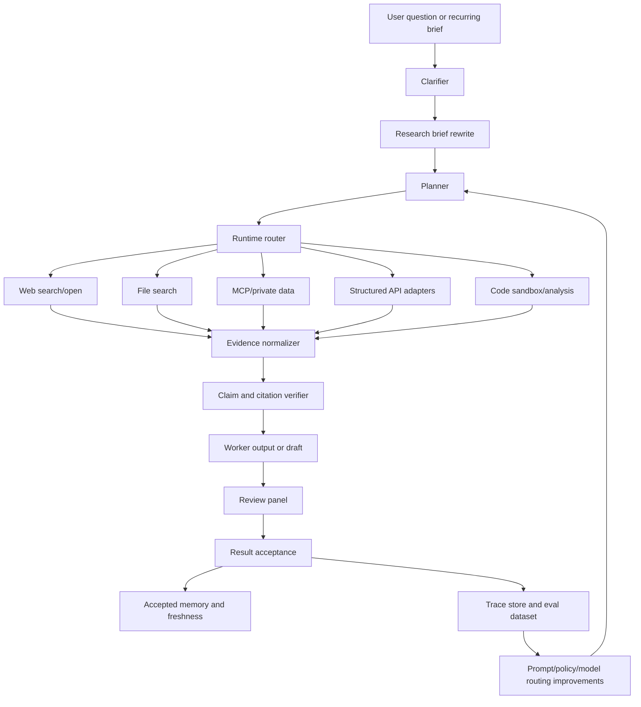

# Integrated Research Runtime And Eval Flywheel Roadmap

Status: In Progress
Current phase: Phase 11 - Optional scalable state backend
Last updated: 2026-05-20
Next action: Measure scaling friction and decide whether optional indexed state is justified
Blocked by: None

Created: 2026-05-20
Input reviewed: `/Users/dzianissokalau/Downloads/async-research-improving.md`

## Summary

This roadmap turns the async-research framework from a governed research-ops
kernel into a stronger integrated research system.

The feedback's core diagnosis is right: the framework already has unusually
strong governance primitives - task contracts, review gates, claim caps,
accepted-memory freshness, cost controls, and deterministic state transitions -
but it still relies too much on external agent surfaces for the actual research
runtime. The next quality leap should therefore come from execution substrate
and evaluation, not from adding more workflow prose.

The target is not to clone a consumer Deep Research product. The target is to
make async-research excellent for repeatable, domain-specific, high-accountability
research programs where auditability, private data, reproducibility, freshness,
and cost discipline matter.

## Product Thesis

Async-research should keep its file-backed governance model, but add an
integrated runtime layer that can:

- clarify and rewrite ambiguous research briefs before execution
- route work across web search, file search, MCP/private data, APIs, and code
- normalize every retrieved source, tool call, and computed result into evidence
  objects
- verify citations and claim support before acceptance
- convert traces into repeatable evals and regression gates
- use model routing deliberately: frontier models for planning, synthesis, and
  critique; cheaper models or deterministic code for extraction and repetition
- preserve human gates for public claims, paid services, credentials, and
  ambiguous evidence

## What I Think

The feedback is directionally strong, with one important framing adjustment:
async-research should not try to beat ChatGPT Deep Research on broad one-shot
open-web research first. That is the hardest battleground because Deep Research
already has a polished integrated browsing and reporting substrate.

The more sensible path is to win where async-research has natural structural
advantages:

- recurring research programs
- private or semi-private data workflows
- research that needs reproducible intermediate artifacts
- empirical or data-heavy research with claim gates
- work where stale-memory reuse, source governance, and review independence
  matter
- internal reports that later mature into shareable memos or working papers

The first implementation priority should be a narrow but real runtime/eval loop,
not a giant all-purpose agent platform. Build one high-quality vertical slice:
clarified brief -> runtime tool calls -> evidence objects -> verified claims ->
review -> accepted memory -> eval trace.

## Relationship To Existing Roadmaps

| Existing Roadmap Or Surface | Relationship |
| --- | --- |
| LLM Operator Skill Roadmap | The operator skill helps Codex/LLMs run the framework. This roadmap improves what the framework can do once operated. |
| Knowledge Library Roadmap | Provides source/library memory. This roadmap adds runtime retrieval and evidence normalization around it. |
| Data Foundations Roadmap | Provides data-source governance. This roadmap adds API-first routing and tool traces for accessed data. |
| Hypothesis Testing Framework Roadmap | Provides empirical analysis contracts. This roadmap adds runtime/tool evidence and eval traces around analysis work. |
| Deliverable Maturity And Editorial QA Roadmap | Provides deliverable gates. This roadmap adds claim/citation verification before deliverable review. |
| Dashboard | Should surface runtime traces, evidence verification, eval scores, and unresolved gaps. |
| Future Improvements Backlog | Some backlog items overlap; implementing this roadmap should retire or absorb overlapping future-improvement rows. |

## Design Principles

- Keep `research_ops/` files and public CLI outputs as source of truth.
- Add runtime capability as bounded adapters, not hidden autonomous behavior.
- Every external tool call must produce an auditable trace row and evidence
  object.
- Prefer API-first retrieval where stable structured APIs exist; browse as a
  fallback or for human-facing context.
- Block or downgrade claims that cannot be mapped to evidence spans.
- Treat evals as product infrastructure, not a one-off benchmark.
- Preserve standard-library-first package posture unless a phase explicitly
  decides an optional dependency boundary.
- Do not optimize for agent activity. Optimize for accepted evidence per dollar
  and per minute of human attention.

## Target Architecture



## Resolved Phase 0 Runtime And Evaluation Contract

Phase 0 is delivered as a contract-only slice. It defines the runtime boundary,
adapter taxonomy, evidence object fields, trace fields, quality metrics,
dependency posture, and human gates that later phases must implement.

Authoritative contract docs:

- [Research Runtime Contract](../src/async_research_workflow/docs/research_runtime_contract.md)
- [Evaluation Flywheel](../src/async_research_workflow/docs/evaluation_flywheel.md)

Locked decisions:

- Runtime adapters may fetch, search, parse, compute, summarize, and emit
  artifacts, but workflow commands still own task state transitions.
- Review, result acceptance, deliverable maturity, and accepted-memory commands
  remain the only surfaces that can accept evidence or publication readiness.
- Dashboard and console surfaces remain derived visibility layers, not sources
  of truth.
- Adapter classes are `web_search`, `web_open`, `file_search`, `file_fetch`,
  `mcp_search`, `mcp_fetch`, `api_query`, and `code_execute`.
- Runtime capability is read-only by default; missing task-contract permission
  data fails closed.
- Network, credentials, paid calls, unsafe source use, public claims, and
  ambiguous private/public boundaries require explicit task-contract permission
  or a recorded human gate.
- Evidence object minimum fields are `evidence_id`, `task_id`, `adapter_type`,
  `source_uri`, `source_title`, `retrieved_at`, `content_hash`,
  `snapshot_path`, `span_refs`, `license_or_use_policy`, `freshness_status`,
  `cost`, and `permission_basis`.
- Runtime trace minimum fields are `trace_id`, `task_id`, `tool_name`,
  `input_summary`, `output_summary`, `artifact_paths`, `return_code`,
  `duration_ms`, `token_usage`, `cost`, and `error`.
- Quality metrics are expert preference win rate, grounded claim rate,
  unsupported claim rate, task success rate, accepted-output rate, cost per
  accepted report, median latency to accepted report, freshness failure rate,
  reviewer disagreement rate, and reproducibility pass rate.
- Core dependency posture remains standard-library first. Provider SDKs,
  network adapters, and other external integrations belong in optional runtime
  extras or plugin adapter packages after the contracts are proven.
- Head-to-head Deep Research-style comparison claims are allowed only inside
  named domain packs with benchmark evidence, explicit source permissions,
  reviewer rubrics, and clear wins, losses, and unproven areas.

## Resolved Phase 1 Evidence Objects And Trace Ledger

Phase 1 is delivered as the runtime artifact substrate for future adapters. It
adds schemas, validators, ledger locations, CLI summaries, console snapshot
fields, starter template runtime directories, and offline fixtures without
implementing live fetching or accepting evidence automatically.

Authoritative artifact docs and schemas:

- [Runtime Artifacts](../src/async_research_workflow/docs/runtime_artifacts.md)
- [Runtime Evidence Object Schema](../src/async_research_workflow/schemas/runtime_evidence_object.schema.json)
- [Runtime Trace Schema](../src/async_research_workflow/schemas/runtime_trace.schema.json)

Locked decisions:

- Runtime ledgers live at `research_ops/runtime/evidence_objects.jsonl` and
  `research_ops/runtime/traces.jsonl`; snapshots live under
  `research_ops/runtime/snapshots/`.
- `async-research runtime validate`, `summary`, and `inspect-evidence` are
  read-only public CLI surfaces.
- Validators fail closed for malformed rows, missing task links, paths outside
  `research_ops/`, missing snapshots, and snapshot hash mismatches.
- Missing or unknown license/use-policy metadata is warning-level and counted
  as unsupported until resolved.
- Console snapshots expose runtime trace count, evidence object count,
  unsupported or stale evidence count, latest runtime errors, and validation
  findings as derived read-only fields.
- Evidence objects remain normalized runtime artifacts only; review and
  result-acceptance gates still decide accepted evidence.

## Resolved Phase 2 Clarifier And Research Brief Rewrite

Phase 2 is delivered as the pre-planning contract for broad or ambiguous
research requests. It defines a bounded `research_brief.json` artifact, public
draft/validate/apply dry-run commands, planner prompt guidance, and task/idea
integration without adding a chat UI, runtime adapters, or live fetching.

Authoritative brief docs and schema:

- [Research Brief Contract](../src/async_research_workflow/docs/research_brief_contract.md)
- [Research Brief Schema](../src/async_research_workflow/schemas/research_brief.schema.json)

Locked decisions:

- The canonical brief path is `research_ops/briefs/research_brief.json`.
- `async-research brief draft` creates a draft contract from flags or
  `briefs/source_request.md`; unresolved questions remain blocking.
- `async-research brief validate` fails closed unless the brief has a concrete
  objective, output maturity, target audience, non-overlapping source policy,
  no unresolved questions, no pending human gates, `status=ready`, and no
  blocked private-data policy.
- `async-research brief apply` is dry-run only in Phase 2 and returns a
  planner-facing `workflow create-task ... --brief ... --dry-run` command
  rather than mutating `research_ops/`.
- `workflow create-task` and `idea promote` consume a validated ready brief
  when one is explicitly supplied or when the default workspace brief exists.
- A non-ready default brief blocks task creation and idea promotion until the
  operator resolves blockers or removes the default brief for tiny maintenance
  work.
- Brief permissions narrow browsing, network, code execution, and budget caps;
  explicit CLI flags cannot broaden a task beyond the ready brief.
- Idea promotion preflight hashes include the brief summary so write mode is
  tied to the reviewed brief contract.
- Human gates are explicit for credentials, paid services, private data, public
  claims, and nonzero paid API budgets.
- Briefs do not become accepted evidence and do not authorize runtime adapters
  by themselves; task contracts, runtime traces, review, and result acceptance
  still govern execution and acceptance.

## Resolved Phase 3 Minimal Unified Runtime Adapters

Phase 3 is delivered as the first bounded runtime execution slice. It adds a
single adapter interface, public dry-run and execute commands, deterministic
local adapters, mocked-only external adapters, task-contract permission checks,
trace/evidence emission, and an offline vertical-slice fixture.

Authoritative adapter docs:

- [Runtime Adapters](../src/async_research_workflow/docs/runtime_adapters.md)

Locked decisions:

- `async-research runtime dry-run` is read-only and reports planned local or
  mocked adapter calls against a task contract.
- `async-research runtime execute` writes only
  `research_ops/runtime/traces.jsonl`,
  `research_ops/runtime/evidence_objects.jsonl`, and snapshots under
  `research_ops/runtime/snapshots/`; it never transitions task state or accepts
  evidence.
- Runtime requests require explicit task contract bounds: `allowed_tools`,
  `allowed_paths`, `runtime_permissions.max_calls`, budget ceilings, and the
  relevant network, browsing, code execution, domain, API, MCP, credential, and
  paid-call permissions.
- `file_fetch`, `file_search`, and `code_execute` are standard-library local
  adapters. `code_execute` is restricted to deterministic built-in summary
  operations.
- `web_search`, `web_open`, `mcp_search`, `mcp_fetch`, and `api_query` are
  mocked-only in Phase 3. They fail closed without explicit task-contract
  permission and a `mock_response`; the core package performs no live network,
  credentialed, or paid calls.
- Blocked executions may write a `blocked_by_policy` trace for audit, but they
  write no evidence objects.
- Runtime evidence objects remain normalized runtime artifacts only; review and
  result-acceptance gates still decide accepted evidence.

## Resolved Phase 4 Claim And Citation Verification

Phase 4 is delivered as the deterministic citation and claim-support gate
between runtime evidence objects, result acceptance, and publication-oriented
deliverables. It adds explicit claim objects, offline verifier outcomes,
evidence-span mapping, result-acceptance claim gates, deliverable maturity
readiness gates, dashboard visibility, and fixture coverage for supported,
missing, stale, contradicted, and numeric claims.

Authoritative verification docs and schemas:

- [Claim And Citation Verification](../src/async_research_workflow/docs/claim_citation_verification.md)
- [Claim Verification Schema](../src/async_research_workflow/schemas/claim_verification.schema.json)

Locked decisions:

- Claim verification reads explicit claim artifacts, result summaries,
  worker-output JSON blocks, and deliverable claim artifacts; it does not fetch
  live sources.
- Atomic claim objects include `claim_id`, `text`, `claim_type`, `strength`,
  `required_support_level`, `evidence_refs`, `citation_refs`,
  `verification_status`, and `failure_reason`.
- Evidence and citation references map to runtime evidence IDs, source URIs,
  span refs, quote/paraphrase status, source freshness, and computation
  artifacts.
- Supported verifier outcomes are `supported`, `weakly_supported`,
  `unsupported`, `contradicted`, `stale`, and `unverifiable`.
- Unsupported, contradicted, or unverifiable material claims block result
  acceptance; weak, stale, or unresolved support caps maximum claim strength.
- Contradicted claims create skeptic-review follow-ups.
- Working-paper and submission-ready deliverables require resolved claim and
  citation verification before readiness can pass.
- Claim verification rows are written to
  `research_ops/claim_verification_ledger.md` when ledgers are updated.
- The verifier remains an offline deterministic gate; it does not promise
  perfect truth verification or enforce formal bibliography style.

## Resolved Phase 5 Trace-Driven Eval Flywheel

Phase 5 is delivered as the first deterministic offline eval flywheel for
runtime-backed research. It adds eval suite/run schemas, build/run/compare
commands, dashboard metrics, starter eval locations, release-policy checks, and
fixture coverage without requiring paid live model calls or optimizing prompts
automatically.

Authoritative eval docs and schemas:

- [Runtime Evals](../src/async_research_workflow/docs/runtime_evals.md)
- [Runtime Eval Suite Schema](../src/async_research_workflow/schemas/runtime_eval_suite.schema.json)
- [Runtime Eval Run Schema](../src/async_research_workflow/schemas/runtime_eval_run.schema.json)

Locked decisions:

- Eval artifacts live under `research_ops/evals/`, with run reports under
  `research_ops/evals/runs/`.
- `async-research eval build-from-traces` builds suites from runtime traces,
  evidence objects, task status, review aggregates, result acceptance, and
  claim-verification artifacts; it is read-only unless `--write` is supplied.
- `async-research eval run` executes deterministic schema/path/hash,
  groundedness, citation-support, task-success, and cost/latency graders.
- `async-research eval compare` is read-only and blocks candidate releases when
  groundedness, unsupported-claim rate, task success, accepted-output rate,
  freshness, reproducibility, or cost per accepted report regress beyond policy.
- Human preference and subjective rubric graders remain explicit placeholders
  until calibrated reviewer data is attached.
- Console snapshots expose eval suite count, run count, latest run status,
  quality metrics, and release-policy posture as derived read-only fields.

## Resolved Phase 6 GPT-5.5-Era Prompt And Model Routing

Phase 6 is delivered as the provider-neutral routing and prompt-adoption gate
for runtime-backed research roles. It keeps role posture in prompts while moving
hard safety rules into validators, contracts, runtime permissions, claim gates,
and eval comparison.

Authoritative routing docs and schemas:

- [Model Routing Policy](../src/async_research_workflow/docs/model_routing_policy.md)
- [Model Routing Policy Schema](../src/async_research_workflow/schemas/model_routing_policy.schema.json)

Locked decisions:

- The canonical routing policy path is
  `research_ops/prompts/model_routing_policy.json`.
- `async-research model-routing init`, `validate`, `select`, and `eval-check`
  are the public CLI surfaces for creating policies, inspecting role routes, and
  gating candidate prompt/routing adoption.
- The routing policy defines capability tiers rather than provider names:
  `deterministic`, `cheap`, `standard`, `frontier`, and `human`.
- Required routes are planner, worker, extractor, methodology reviewer, skeptic
  reviewer, and synthesizer.
- Hard rules are explicitly owned by validators, task contracts, runtime adapter
  permissions, claim verification, result acceptance, deliverable maturity, and
  runtime evals instead of prompt prose alone.
- Candidate prompt/routing changes must retain a baseline and pass
  `async-research model-routing eval-check` against Phase 5 eval runs before
  adoption.
- Eval-check adoption fails when groundedness, unsupported-claim rate, task
  success, accepted-output rate, freshness, reproducibility, or cost per
  accepted report regresses.
- The provider-neutral policy validator fails closed on hard-coded proprietary
  provider or model names.
- Generated prompt-library prompts reference the routing policy and warn when a
  prompt lacks that reference, but old prompt variants remain valid baselines.

## Resolved Phase 7 Hybrid API-First Routing

Phase 7 is delivered as an offline, policy-first route-decision slice. It adds
source preference classes, route rationale metadata on runtime traces, mock
source profiles for common external classes, browser fallback governance, and
route-aware eval fixtures without adding live production integrations.

Authoritative routing docs and schemas:

- [Research Runtime Contract](../src/async_research_workflow/docs/research_runtime_contract.md)
- [Runtime Adapters](../src/async_research_workflow/docs/runtime_adapters.md)
- [Runtime Artifacts](../src/async_research_workflow/docs/runtime_artifacts.md)
- [Runtime Evals](../src/async_research_workflow/docs/runtime_evals.md)
- [Runtime Trace Schema](../src/async_research_workflow/schemas/runtime_trace.schema.json)
- [Runtime Eval Suite Schema](../src/async_research_workflow/schemas/runtime_eval_suite.schema.json)

Locked decisions:

- Source preference order is `official_api`,
  `authoritative_downloadable_data`, `official_page`,
  `reputable_third_party_database`, `general_web_page`, then
  `user_provided_source`.
- Every runtime adapter trace emitted by the core runtime records
  `route_decision` with selected adapter, selected source class, rejected
  alternatives, reason, cost estimate, freshness expectation, license/use note,
  and browser fallback status.
- Mock source profiles cover `statistical_api`, `document_repository`,
  `search_endpoint`, and `private_mcp_source` without making live network calls.
- Browser routes require `browser_fallback_reason` set to `api_unavailable`,
  `api_incomplete`, or `human_context_required`, plus the existing browsing,
  network, allowed-domain, mock-response, and snapshot evidence gates.
- Runtime validation reports route decision and browser fallback counts, and it
  fails closed if web route metadata contradicts browser fallback requirements.
- Runtime eval suites include source-route decisions, source-routing grader
  checks, API-only/browser-only/hybrid fixture patterns, and route metrics that
  can show cost improvement only within the recorded fixture evidence.

## Resolved Phase 8 Structured Evidence Memory And Targeted Reflection

Phase 8 is delivered as a derived, repo-first evidence memory and reflection
slice. It adds a machine-queryable accepted-evidence index and targeted
reflection records without adding a database or replacing authoritative
`research_ops/` artifacts.

Authoritative memory docs and schemas:

- [Structured Evidence Memory And Targeted Reflection](../src/async_research_workflow/docs/structured_evidence_memory.md)
- [Evidence Memory Index Schema](../src/async_research_workflow/schemas/evidence_memory_index.schema.json)
- [Targeted Reflection Schema](../src/async_research_workflow/schemas/targeted_reflection.schema.json)

Locked decisions:

- The derived evidence memory index lives at
  `research_ops/memory/evidence_memory_index.json`.
- Targeted reflection rows live at
  `research_ops/reflections/targeted_reflections.jsonl`.
- `async-research evidence-memory update` derives claim IDs, evidence IDs,
  source IDs, freshness status, contradiction edges, task lineage, and
  deliverable links from existing accepted-memory, runtime-evidence,
  claim-verification, deliverable, and reflection artifacts.
- `async-research evidence-memory query` is read-only and surfaces stale or
  contradicted evidence before reuse; when no index file exists it builds a
  read-only in-memory view and reports that fallback.
- `async-research reflection record` writes bounded failure-class reflection
  rows only when review evidence resolves to an existing file inside
  `research_ops/`.
- `async-research anti-context build` preserves accepted-memory and
  rejected-idea anti-context while injecting only active, relevant targeted
  reflection rows above the similarity threshold.
- Structured evidence memory remains a derived planning/read-model aid. Review,
  result acceptance, deliverable maturity, claim verification, and task state
  remain the acceptance sources of truth.

## Resolved Phase 9 Bounded Parallel Research Threads

Phase 9 is delivered as a deterministic, planner-controlled parallel research
slice. It allows bounded fan-out for source gathering and extraction while
keeping task state, review, claim verification, and human gates outside runtime
adapter control.

Authoritative parallel research docs and schemas:

- [Bounded Parallel Research Threads](../src/async_research_workflow/docs/bounded_parallel_research.md)
- [Research Runtime Contract](../src/async_research_workflow/docs/research_runtime_contract.md)
- [Runtime Adapters](../src/async_research_workflow/docs/runtime_adapters.md)
- [Runtime Evals](../src/async_research_workflow/docs/runtime_evals.md)
- [Task Status Schema](../src/async_research_workflow/schemas/task_status.schema.json)
- [Runtime Eval Suite Schema](../src/async_research_workflow/schemas/runtime_eval_suite.schema.json)

Locked decisions:

- Runtime requests may use `mode: "parallel_research"` only when
  `runtime_permissions.parallel_research.enabled=true` is present in the task
  contract.
- Supported branch shapes are `source_gathering`,
  `literature_extraction`, `market_map_slice`,
  `policy_jurisdiction_comparison`, and `data_source_profiling`.
- Parallel requests must include a planner-controlled `parallel_plan` with a
  deterministic review-packet merge strategy, branch-specific allowed paths,
  branch budgets, and at least two valid branch IDs.
- Branches are bounded by global runtime limits, branch call counts,
  branch-specific API/compute budgets, branch source paths, and optional
  task-local `LOCK/owner.json` coordinator checks.
- Runtime traces and evidence objects are tagged with `parallel_branch`
  lineage, but branch output cannot request direct acceptance, skip review,
  skip claim verification, or bypass human gates.
- Successful parallel execution writes exactly one Markdown merge packet under
  `research_ops/runtime/parallel_merges/`; the packet is review context only.
- Runtime validation and eval reports expose parallel branch counts, trace
  counts, merge packet counts, and a `bounded_parallelism` grader for fixture
  cases that should trigger parallelism.

## Resolved Phase 10 Domain Packs And Head-To-Head Benchmark

Phase 10 is delivered as the first honest domain-pack benchmark slice. It
selects climate/coffee economics, packages source policy, brief and task
templates, claim gates, reviewer rubrics, eval cases, baseline/candidate runs,
an example workspace skeleton, and comparison reports without live network
calls, credentials, paid services, or proprietary Deep Research-style outputs.

Authoritative domain-pack docs and artifacts:

- [Domain Packs And Benchmarking](../src/async_research_workflow/docs/domain_packs.md)
- [Climate Coffee Economics Domain Pack](../src/async_research_workflow/domain_packs/climate_coffee_economics/README.md)
- [Climate Coffee Comparison Report](../src/async_research_workflow/domain_packs/climate_coffee_economics/comparison_report.md)
- [Climate Coffee Eval Cases](../src/async_research_workflow/domain_packs/climate_coffee_economics/eval_cases.json)

Locked decisions:

- The first benchmark domain is `climate/coffee economics`, chosen because the
  roadmap named it and the repository already had a coffee deliverable maturity
  fixture to build from without external credentials.
- Default benchmark execution is offline and fixture-backed. Live source
  acquisition, paid APIs, credentials, and private buyer data publication
  require explicit task-contract permission and human gates.
- The packaged comparison may state only that the runtime-backed domain pack
  improves deterministic metrics over the bundled generic baseline for this
  domain fixture.
- Proprietary Deep Research-style outputs and expert preference win rate remain
  unproven until permissioned, dated, prompt-linked artifacts and calibrated
  paired reviewer scores are recorded.
- One domain pack does not support broad superiority claims over ChatGPT Deep
  Research or other general-purpose Deep Research-style products.

## Phased Plan

| Phase | Status | Priority | Focus | Scope | Exit Criteria |
| ---: | --- | --- | --- | --- | --- |
| 0 | Delivered | P0 | Runtime and evaluation contract | Define runtime boundary, adapter contract, evidence object schema, trace schema, dependency posture, and success metrics. | Another LLM can implement adapters and evals without guessing what counts as evidence or success. |
| 1 | Delivered | P0 | Evidence objects and trace ledger | Add schemas and validators for tool calls, source snapshots, extracted spans, computed outputs, hashes, costs, and permissions. | Every future runtime action has a stable, auditable artifact format. |
| 2 | Delivered | P0 | Clarifier and research brief rewrite | Add a pre-planning stage for clarifying questions, scope decisions, output target, source policy, and rewritten executable brief. | Ambiguous research requests are turned into bounded task briefs before planning. |
| 3 | Delivered | P0 | Minimal unified runtime adapters | Implement a narrow adapter interface for web, file, API, MCP, and code tools, with read-only defaults and trace emission. | One vertical-slice research task can call tools and write evidence objects without bespoke glue. |
| 4 | Delivered | P0 | Claim and citation verification | Extract claims, map them to evidence spans, verify citation provenance, and block or cap unsupported claims. | Review cannot accept source-grounded outputs with unmapped or unsupported material claims. |
| 5 | Delivered | P0 | Trace-driven eval flywheel | Turn runtime traces into fixture datasets, graders, regression commands, and dashboard metrics. | Quality changes can be evaluated against repeatable traces before release. |
| 6 | Delivered | P1 | GPT-5.5-era prompt and model routing | Slim prompts, move brittle rules into validators, and define planner/workhorse/critic routing policies. | The framework uses stronger models where they matter and cheaper paths where they are enough. |
| 7 | Delivered | P1 | Hybrid API-first routing | Prefer structured APIs where available, browse where necessary, and record source selection rationale. | Runtime chooses reliable machine interfaces before expensive or fragile browsing. |
| 8 | Delivered | P1 | Structured evidence memory and targeted reflection | Add queryable evidence state, contradiction links, failure classes, and targeted critic routing. | Accepted memory becomes machine-queryable without replacing repo artifacts as truth. |
| 9 | Delivered | P2 | Bounded parallel research threads | Allow planner-controlled source-gathering or literature-extraction fan-out with deterministic merge and review. | Parallelism improves coverage without uncontrolled swarms or hidden writes. |
| 10 | Delivered | P2 | Domain packs and head-to-head benchmark | Package one domain-specific runtime/eval pack and compare against baseline Deep Research-style outputs. | The framework has evidence of where it can beat general-purpose research products. |
| 11 | Not Started | P3 | Optional scalable state backend | Decide whether event-log, queue, or indexed state storage is needed beyond repo files. | Scaling work is justified by measured friction, not assumed upfront. |

## Phase 0 - Runtime And Evaluation Contract

### Objective

Define what the runtime is allowed to do, what every runtime action must record,
and how quality will be measured.

### Owned Files

- `roadmaps/in_progress_integrated_research_runtime_eval_flywheel_roadmap.md`
- optionally `src/async_research_workflow/docs/research_runtime_contract.md`
- optionally `src/async_research_workflow/docs/evaluation_flywheel.md`
- `roadmaps/README.md`

### Implementation Steps

1. Define the runtime boundary:
   - runtime adapters may fetch, search, parse, compute, and summarize
   - workflow commands still own task state transitions
   - review/result-acceptance commands still own acceptance
   - dashboard remains a visibility surface, not source of truth
2. Define adapter classes:
   - `web_search`
   - `web_open`
   - `file_search`
   - `file_fetch`
   - `mcp_search`
   - `mcp_fetch`
   - `api_query`
   - `code_execute`
3. Define allowed default posture:
   - read-only by default
   - network disabled unless task contract allows it
   - credentials require human gate
   - paid calls require budget/approval policy
   - no source is accepted merely because it was retrieved
4. Define evidence object minimum fields:
   - `evidence_id`
   - `task_id`
   - `adapter_type`
   - `source_uri`
   - `source_title`
   - `retrieved_at`
   - `content_hash`
   - `snapshot_path`
   - `span_refs`
   - `license_or_use_policy`
   - `freshness_status`
   - `cost`
   - `permission_basis`
5. Define trace minimum fields:
   - `trace_id`
   - `task_id`
   - `tool_name`
   - `input_summary`
   - `output_summary`
   - `artifact_paths`
   - `return_code`
   - `duration_ms`
   - `token_usage`
   - `cost`
   - `error`
6. Define quality metrics:
   - expert preference win rate
   - grounded claim rate
   - unsupported claim rate
   - task success rate
   - accepted-output rate
   - cost per accepted report
   - median latency to accepted report
   - freshness failure rate
   - reviewer disagreement rate
   - reproducibility pass rate
7. Decide dependency posture:
   - standard-library core only
   - optional runtime extras
   - plugin adapter packages
   - or hard runtime dependencies

### Acceptance Criteria

- Runtime boundary is explicit.
- Evidence and trace schemas are documented.
- Metrics are specific enough to drive eval implementation.
- Dependency posture is chosen before code work starts.
- Human gates are explicit for credentials, paid APIs, public claims, and unsafe
  source use.

### Verification

Use the shared roadmap checks in `roadmaps/README.md`.

### Non-Goals

- Do not implement adapters in Phase 0.
- Do not add external dependencies in Phase 0.
- Do not replace existing task/review/acceptance state machines.

## Phase 1 - Evidence Objects And Trace Ledger

### Objective

Create the artifact contracts that every future runtime adapter must write.

### Owned Files

- `src/async_research_workflow/schemas/` or equivalent schema location
- runtime/evidence docs
- CLI validators
- fixture workspaces
- tests

### Implementation Steps

1. Add schema files for evidence objects and runtime traces.
2. Add deterministic validators:
   - validate required fields
   - validate IDs and task links
   - validate artifact paths stay inside `research_ops/`
   - validate hashes when snapshots exist
   - warn on missing license/use-policy metadata
3. Add a trace ledger location, for example:
   - `research_ops/runtime/traces.jsonl`
   - `research_ops/runtime/evidence_objects.jsonl`
   - `research_ops/runtime/snapshots/`
4. Add CLI commands:
   - `async-research runtime validate <research_ops>`
   - `async-research runtime summary <research_ops>`
   - `async-research runtime inspect-evidence <research_ops> <evidence-id>`
5. Add dashboard snapshot fields:
   - runtime trace count
   - evidence object count
   - unsupported or stale evidence count
   - latest runtime errors
6. Add fixtures for valid, missing-field, stale, bad-path, and hash-mismatch
   evidence objects.

### Acceptance Criteria

- Runtime evidence can be validated without live external services.
- Bad paths and malformed evidence fail closed.
- Dashboard and console snapshot can summarize runtime evidence state.
- Existing accepted-memory and result-acceptance flows are not broken.

### Non-Goals

- Do not implement live web/API fetching yet.
- Do not make evidence objects accepted evidence automatically.

## Phase 2 - Clarifier And Research Brief Rewrite

### Objective

Add a pre-planning stage that turns vague user intent into a bounded executable
research brief.

### Owned Files

- brief schema/docs
- task templates
- prompt library entries
- CLI support
- tests/fixtures

### Implementation Steps

1. Define `research_brief.json` or equivalent Markdown+JSON contract:
   - user question
   - clarified objective
   - intended output maturity
   - target audience/venue
   - allowed source classes
   - forbidden source classes
   - private-data policy
   - browsing/API/code permissions
   - budget and time caps
   - known assumptions
   - unresolved questions
2. Add commands:
   - `async-research brief draft <research_ops>`
   - `async-research brief validate <brief-path>`
   - `async-research brief apply <research_ops> <brief-path> --dry-run`
3. Add prompt-library guidance for:
   - when to ask clarifying questions
   - when to proceed with assumptions
   - how to rewrite a brief for execution
   - when to stop for human approval
4. Wire idea promotion and task creation to consume a validated brief where
   available.
5. Add fixtures:
   - clear brief
   - ambiguous brief requiring human question
   - missing audience
   - public-claim brief requiring stricter gates
   - private-data brief requiring credential stop

### Acceptance Criteria

- Planner does not start broad research from ambiguous prompts without a brief.
- Output target and audience are available before synthesis/drafting.
- Human gates appear when the brief requires credentials, paid access, or public
  claims.

### Non-Goals

- Do not build chat UI.
- Do not require clarifier for every tiny maintenance task.

## Phase 3 - Minimal Unified Runtime Adapters

### Objective

Implement the smallest useful runtime adapter layer that can support one
end-to-end research vertical slice.

### Owned Files

- runtime adapter modules
- adapter docs
- CLI wrappers
- fixtures and tests
- dashboard/console read models

### Implementation Steps

1. Define a single adapter interface with:
   - `capabilities()`
   - `dry_run(request)`
   - `execute(request)`
   - `to_trace()`
   - `to_evidence_objects()`
2. Implement deterministic/local adapters first:
   - file search/fetch over workspace-approved files
   - local Markdown/PDF text extraction if dependencies already exist or are
     optional extras
   - code execution wrapper around existing analysis conventions
3. Add external adapters behind explicit capability flags:
   - web search/open adapter
   - MCP search/fetch adapter
   - generic structured API query adapter
4. Add task-contract integration:
   - `allowed_tools`
   - network permission
   - credentials required
   - max calls
   - max cost
   - allowed domains or API names
5. Ensure every adapter emits trace and evidence artifacts.
6. Add a runtime dry-run command that reports planned tool calls without
   executing network or paid actions.
7. Add one vertical-slice fixture:
   - validated brief
   - one file source
   - one mocked web/API source
   - evidence objects
   - worker output
   - review packet

### Acceptance Criteria

- Runtime adapters are optional and bounded by task contract permissions.
- Adapter outputs are auditable through evidence objects.
- Mocked external adapters allow tests to run offline.
- One end-to-end fixture proves the runtime can support a real research task.

### Non-Goals

- Do not implement every provider or source type.
- Do not let runtime adapters transition task state directly.

## Phase 4 - Claim And Citation Verification

### Objective

Prevent unsupported or mis-cited claims from reaching accepted evidence or
publication-oriented deliverables.

### Owned Files

- claim extraction/verifier modules
- result-acceptance integration
- deliverable maturity integration
- fixtures and tests
- docs

### Implementation Steps

1. Define atomic claim object fields:
   - `claim_id`
   - `text`
   - `claim_type`
   - `strength`
   - `required_support_level`
   - `evidence_refs`
   - `citation_refs`
   - `verification_status`
   - `failure_reason`
2. Add claim extraction from:
   - worker outputs
   - result summaries
   - deliverable drafts
3. Add citation/evidence mapping:
   - evidence ID
   - source URI
   - span reference
   - quote or paraphrase status
   - source freshness status
4. Add verifier outcomes:
   - `supported`
   - `weakly_supported`
   - `unsupported`
   - `contradicted`
   - `stale`
   - `unverifiable`
5. Integrate with result acceptance:
   - block hard unsupported empirical claims
   - cap claim strength where support is weak
   - route contradictions to skeptic review
   - record unresolved claims in ledgers
6. Integrate with deliverable maturity:
   - working-paper/submission-ready outputs require citation verification
   - unresolved citation gaps block readiness
7. Add fixtures:
   - supported citation
   - missing citation
   - stale source
   - contradicted source
   - numeric claim with no computation artifact

### Acceptance Criteria

- Unsupported material claims cannot be accepted silently.
- Claim caps are visible in result acceptance and dashboard surfaces.
- Citation verification can run without live network when evidence snapshots
  exist.

### Non-Goals

- Do not promise perfect truth verification.
- Do not require formal bibliography style enforcement in this phase.

## Phase 5 - Trace-Driven Eval Flywheel

### Objective

Turn real runtime activity into repeatable evaluation datasets and release
regression gates.

### Owned Files

- eval dataset schema
- grader modules or prompts
- CLI commands
- benchmark fixtures
- dashboard/metrics read models

### Implementation Steps

1. Define eval case fields:
   - `case_id`
   - `source_trace_ids`
   - `input_brief`
   - `expected_behavior`
   - `gold_or_reference_evidence`
   - `grader`
   - `metrics`
   - `known_limitations`
2. Add commands:
   - `async-research eval build-from-traces <research_ops>`
   - `async-research eval run <eval-suite>`
   - `async-research eval compare <baseline> <candidate>`
3. Add grader types:
   - deterministic schema/path/hash graders
   - groundedness grader
   - citation-support grader
   - task-success rubric grader
   - cost/latency grader
   - human-review placeholder
4. Add dashboard metrics:
   - grounded claim rate
   - unsupported claim rate
   - accepted-output rate
   - cost per accepted report
   - stale evidence reuse
   - reviewer disagreement
5. Add release policy:
   - prompt/runtime policy changes require eval comparison
   - regressions block marking roadmap phases delivered
   - human-calibrated evals remain marked separately from automated evals

### Acceptance Criteria

- At least one eval suite can be built from fixture traces.
- Eval comparison reports pass/fail, metric deltas, and residual risks.
- Quality claims are tied to eval evidence rather than anecdotes.

### Non-Goals

- Do not require paid live model calls in the default unit test path.
- Do not optimize prompts automatically yet.

## Phase 6 - GPT-5.5-Era Prompt And Model Routing

### Objective

Modernize prompts and model selection so stronger models get freedom where it
helps, while validators enforce hard rules.

### Owned Files

- prompt library
- scheduler/model routing docs
- cost controls
- eval cases
- tests

### Implementation Steps

1. Audit existing prompts for repeated procedural rules that can move into:
   - validators
   - task contracts
   - runtime adapter permissions
   - brief schema
2. Define role-specific prompt posture:
   - planner: brief-aware, high reasoning, fewer brittle lists
   - worker: bounded by task contract and runtime permissions
   - extractor: cheap model or deterministic parser when possible
   - methodology reviewer: frontier model
   - skeptic/contradiction checker: targeted, evidence-first
   - synthesizer: maturity-level aware
3. Add routing config:
   - model tier by role
   - max budget by role
   - escalation triggers
   - fallback model policy
4. Run prompt migration evals against Phase 5 suites.
5. Keep old prompt variants as baselines until new prompts outperform or match
   them on quality and cost.

### Acceptance Criteria

- Prompt changes are evaluated before adoption.
- Hard safety rules remain in validators/contracts, not only in prose.
- Model routing reduces cost without lowering groundedness or task success.

### Non-Goals

- Do not hard-code one proprietary provider as the only path.
- Do not remove explicit stop conditions.

## Phase 7 - Hybrid API-First Routing

### Objective

Prefer reliable structured interfaces over fragile browsing when both are
available.

### Owned Files

- API adapter contracts
- source policies
- runtime router
- fixtures and tests
- docs

### Implementation Steps

1. Add source preference policy:
   - official API
   - authoritative downloadable data
   - official page
   - reputable third-party database
   - general web page
   - user-provided source
2. Add router decision fields:
   - selected adapter
   - rejected alternatives
   - reason
   - cost estimate
   - freshness expectation
   - license/use-policy note
3. Add mock adapters for common classes:
   - statistical API
   - document repository
   - search endpoint
   - private MCP-like source
4. Add browser fallback rule:
   - use browsing when API is unavailable, incomplete, or needed for context
   - snapshot pages when used as evidence
5. Add eval cases comparing API-only, browser-only, and hybrid behavior.

### Acceptance Criteria

- Runtime traces explain why each source route was chosen.
- Hybrid routing improves groundedness or cost in at least one eval fixture.
- Browser fallback does not bypass source governance.

### Non-Goals

- Do not build dozens of production API integrations before the adapter contract
  is proven.

## Phase 8 - Structured Evidence Memory And Targeted Reflection

### Objective

Make accepted evidence and recurring failures easier for machines to query while
preserving repo artifacts as the authoritative record.

### Owned Files

- structured evidence memory schema
- accepted-memory integration
- reflection/failure taxonomy docs
- CLI commands
- tests

### Implementation Steps

1. Add structured evidence index fields:
   - claim IDs
   - evidence IDs
   - source IDs
   - contradiction edges
   - freshness status
   - task lineage
   - deliverable links
2. Add targeted reflection records:
   - failure class
   - trigger condition
   - affected stage
   - mitigation
   - future anti-context injection text
   - review evidence
3. Add commands:
   - `async-research evidence-memory update <research_ops>`
   - `async-research evidence-memory query <research_ops>`
   - `async-research reflection record <task-dir>`
4. Wire targeted reflection into planner context:
   - only inject relevant failure classes
   - avoid dumping stale global warnings
   - preserve rejected-idea anti-context
5. Add fixtures:
   - contradiction detected
   - stale accepted evidence
   - repeated source-quality failure
   - irrelevant reflection suppressed

### Acceptance Criteria

- Machine-queryable memory improves planning context without replacing source
  files.
- Reflection is targeted to recurring failure classes.
- Stale or contradicted evidence is visible before reuse.

### Non-Goals

- Do not add a database as a required runtime dependency in this phase.

## Phase 9 - Bounded Parallel Research Threads

### Objective

Allow controlled parallel source gathering or literature extraction where it
improves coverage, while keeping task state deterministic.

### Owned Files

- planner policy
- runtime router
- task contract extensions
- merge/review docs
- fixtures and tests

### Implementation Steps

1. Define allowed parallel task shapes:
   - source gathering
   - literature extraction
   - market map slices
   - policy/regulatory comparison by jurisdiction
   - data-source profiling
2. Define fan-out constraints:
   - max parallel branches
   - per-branch budget
   - allowed files
   - branch-specific evidence IDs
   - no direct acceptance from branch outputs
3. Define merge requirements:
   - branch summary
   - evidence coverage table
   - contradictions
   - unresolved gaps
   - reviewer packet
4. Add lock/concurrency integration.
5. Add eval cases where parallelism should and should not trigger.

### Acceptance Criteria

- Parallelism is planner-controlled and bounded.
- Branch outputs merge into one reviewable artifact.
- Parallelism cannot skip review, claim verification, or human gates.

### Non-Goals

- Do not create an uncontrolled many-agent swarm.

## Phase 10 - Domain Packs And Head-To-Head Benchmark

### Objective

Prove where async-research can outperform general-purpose Deep Research-style
products by packaging one repeatable domain and evaluating it honestly.

### Owned Files

- `domain_packs/` or agreed package location
- benchmark suites
- example research workspaces
- review rubrics
- docs

### Implementation Steps

1. Pick one first domain:
   - market intelligence
   - regulatory analysis
   - climate/coffee economics
   - real estate economics
   - literature review
2. Create domain pack contents:
   - source policy
   - preferred APIs/sources
   - brief templates
   - task templates
   - claim gates
   - reviewer rubrics
   - eval cases
3. Build benchmark tasks:
   - open-web synthesis
   - private/local file synthesis
   - data/API retrieval
   - empirical check
   - deliverable maturity check
4. Compare:
   - baseline async-research without runtime
   - upgraded async-research
   - manually captured Deep Research-style output where allowed
   - human review baseline where available
5. Report:
   - preference win rate
   - groundedness
   - unsupported claims
   - cost
   - latency
   - human intervention points

### Acceptance Criteria

- The project can state honestly where upgraded async-research wins, loses, or
  remains unproven.
- Domain pack improves at least one meaningful metric over generic operation.
- Benchmark artifacts are reproducible without hidden chat context.

### Non-Goals

- Do not claim broad superiority over ChatGPT Deep Research from one domain.

## Phase 11 - Optional Scalable State Backend

### Objective

Decide whether repo files plus lock directories are enough, or whether a queue,
event log, and indexed read model are needed for higher concurrency.

### Owned Files

- architecture decision record
- optional backend prototype
- migration/compatibility docs
- tests

### Implementation Steps

1. Measure friction from prior phases:
   - trace file size
   - dashboard latency
   - lock contention
   - concurrent branch conflicts
   - eval-suite runtime
2. Decide backend need:
   - no backend
   - optional local SQLite/index cache
   - append-only event log
   - external queue/read model
3. Preserve repo-first audit:
   - backend cache must be rebuildable
   - unique manual decisions stay in files
   - CLI must explain source of every derived value
4. Prototype only if metrics justify it.

### Acceptance Criteria

- Backend decision is evidence-based.
- Any backend is optional or clearly justified.
- Repo artifacts remain the durable audit record.

### Non-Goals

- Do not move core truth out of `research_ops/` by default.

## Prioritized Improvement Table

| Priority | Improvement | Description | Impact | Status |
| --- | --- | --- | --- | --- |
| P0 | Evidence objects and trace ledger | Stable schemas for source snapshots, tool calls, costs, hashes, permissions, and span refs. | Makes integrated runtime auditable instead of opaque. | Not Started |
| P0 | Clarifier and brief rewrite | Converts vague requests into bounded research briefs with audience, output maturity, source policy, and permissions. | Prevents broad, under-specified tasks from entering execution. | Not Started |
| P0 | Minimal unified runtime adapters | One adapter interface for file, web, API, MCP, and code execution, with traces and evidence outputs. | Closes the biggest execution gap versus integrated Deep Research products. | Not Started |
| P0 | Claim and citation verification | Maps atomic claims to evidence spans and blocks or caps unsupported claims. | Directly improves final research quality and trust. | Not Started |
| P0 | Trace-driven eval flywheel | Builds eval cases from traces and gates future prompt/runtime changes. | Turns quality into a measured loop instead of opinion. | Not Started |
| P1 | Prompt and model routing modernization | Slim prompts, keep hard rules in validators, and route model tiers by role. | Improves quality/cost balance with stronger models. | Not Started |
| P1 | Hybrid API-first routing | Prefer structured APIs and authoritative data before browsing. | Improves reliability, freshness, and cost. | Delivered |
| P1 | Structured evidence memory and targeted reflection | Adds queryable evidence and failure memory while preserving repo artifacts. | Improves longitudinal research quality. | Delivered |
| P2 | Bounded parallel research threads | Allows controlled fan-out/fan-in for source gathering and extraction. | Improves coverage without agent-swarm risk. | Not Started |
| P2 | Domain pack and head-to-head benchmark | Proves one vertical where the framework can beat general-purpose research products. | Creates credible external quality evidence. | Not Started |
| P3 | Optional scalable backend | Adds indexed state only if measured friction justifies it. | Helps scale without prematurely abandoning repo-first design. | Not Started |

## Suggested Delivery Order

1. Phase 0 to define contracts and metrics.
2. Phase 1 because runtime without evidence objects would become opaque.
3. Phase 2 because clarified briefs improve every downstream stage.
4. Phase 3 to deliver a narrow runtime vertical slice.
5. Phase 4 before accepting runtime-backed outputs as strong evidence.
6. Phase 5 before optimizing prompts, models, or routing.
7. Phase 6 and Phase 7 together if one implementation pass is desired; they
   both depend on evals.
8. Phase 8 after enough traces exist to identify recurring evidence/failure
   patterns.
9. Phase 9 only after the single-threaded runtime is reliable.
10. Phase 10 once the system is strong enough to benchmark honestly.
11. Phase 11 only if measured scaling friction appears.

## Verification Strategy

For every phase:

```bash
git diff --check
.venv/bin/python -m unittest tests.test_doc_references
```

When implementation files or tests are added:

```bash
.venv/bin/python -m unittest discover -s tests
```

When runtime adapters or eval commands are added, include offline fixture tests
that do not require network, credentials, or paid API calls.

When network-capable adapters are added, include explicit tests that verify they
fail closed without task-contract permission.

## Open Decisions

- Should runtime schemas live under existing `schemas/`, a new `runtime/`
  package, or both?
- Should runtime adapters be standard-library only, optional extras, or plugin
  packages?
- What is the first domain pack for benchmarking?
- Which source classes are allowed in the first vertical slice?
- Should the first web/API adapters be mocked-only, local-only, or live behind
  explicit opt-in?
- How should human expert preference reviews be stored without making private
  reviewer notes public by default?
