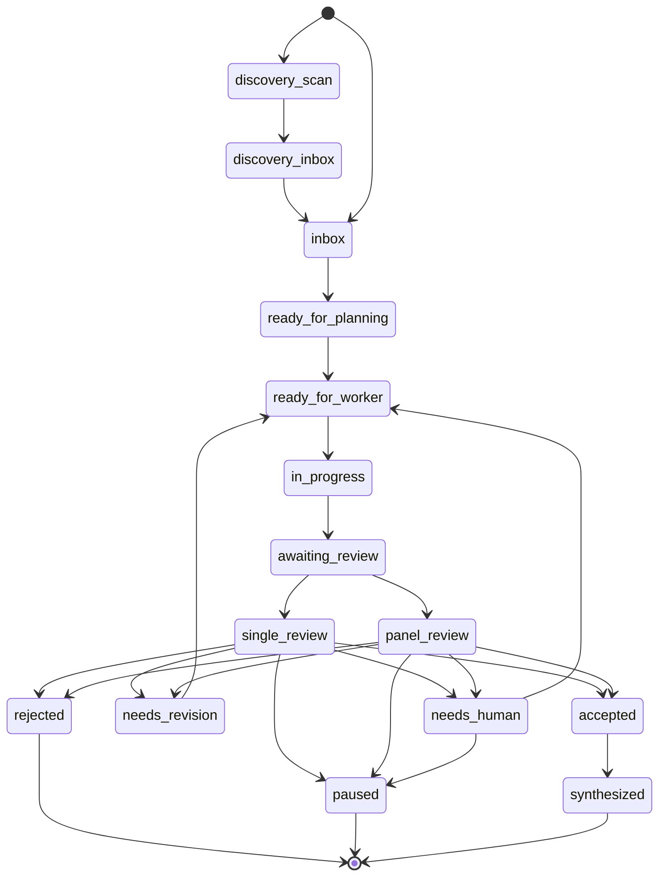

# Workflow Blueprint

## Design Principle

The repo is the memory. The scheduler is the clock. Codex is the worker. The review panel is the brake. The human is the governor.

Operating priority:

```text
quality > independence > low cost > speed
```

The workflow should be comfortable with one-day or one-week turnaround cycles. It should optimize for clean evidence and low human intervention, not constant motion.

## State Machine



## Folder Layout

```text
research_ops/
  discovery_inbox.md
  inbox.md
  queue.md
  daily_status.md
  weekly_digest.md
  cost_ledger.csv
  decisions.md
  data_source_audit.md
  data/
    data_catalog.md
    data_access.md
    join_map.md
    known_data_gaps.md
    profiles/
  metrics_baseline.json
  metrics_history.jsonl
  discovery/
    source_register.md
    rejected_ideas.md
    clusters.md
  review_panel/
    policy.md
    reviewer_registry.md
  tasks/
    TASK-0001-slug/
      task.md
      anti_context.md
      status.json
      worker_output.md
      reviews/
        primary.md
        methodology.md
        skeptic.md
      review_panel/
        aggregate.md
      artifacts/
        sources.md
        notes.md
```

## File Ownership

| Role | Can write | Should not write |
| --- | --- | --- |
| Human | all files | none |
| Discovery Scout | `discovery_inbox.md`, `discovery/`, idea candidate files | `queue.md`, task folders, `data_source_audit.md` |
| Planner | `queue.md`, new task folders, `daily_status.md`, catalog writes only through `async-research idea ... --write` commands | `worker_output.md`, `reviews/`, `review_panel/`, hand-edited generated catalog blocks |
| Worker | `worker_output.md`, `artifacts/`, limited `status.json` fields; for data-readiness tasks, `data_source_audit.md` and `data/**` when listed in `allowed_paths` | `queue.md`, other task folders |
| Primary Reviewer | `reviews/primary.md`, review fields in `status.json`, `daily_status.md` | worker artifacts unless explicitly fixing metadata |
| Specialist Reviewer | its own file under `reviews/` | other reviewer files before aggregate exists |
| Review Aggregator | `review_panel/aggregate.md`, final review fields in `status.json` | worker artifacts and individual review files |
| Synthesizer | `weekly_digest.md`, accepted-summary artifacts | active worker outputs |

This avoids two jobs editing the same file and preserves independent first-pass reviews.

## Locking Protocol

Every task uses a task-local atomic lock directory:

```text
research_ops/tasks/TASK-0001-slug/LOCK/
```

Workers acquire the lock by atomically creating `LOCK/`. The `status.json` fields are observability metadata, not the authoritative lock.

Every task also has `status.json`:

```json
{
  "schema_version": "1.0",
  "prompt_versions": {
    "planner": "planner_v1.0",
    "worker": "worker_v1.0",
    "primary_reviewer": "primary_reviewer_v1.0"
  },
  "framework_versions": {
    "result_acceptance": "result_acceptance_v1.0",
    "review_aggregation": "review_aggregation_v1.0",
    "data_source_audit": "data_source_audit_v1.0"
  },
  "id": "TASK-0001",
  "status": "ready_for_worker",
  "previous_status": null,
  "last_transition_reason": "planner_created_task",
  "lock_owner": null,
  "lock_expires_at": null,
  "allowed_paths": ["research_ops/tasks/TASK-0001-slug"],
  "max_minutes": 45,
  "max_turns": 6,
  "data_audit_refs": [],
  "requires_human": false
}
```

Worker claim rule:

1. Pick the oldest task with `status = ready_for_worker`.
2. Attempt to acquire `LOCK/` using `async_research_workflow/scripts/task_lock.py`.
3. Skip the task if lock acquisition fails because the lock is fresh.
4. If the lock is stale, the helper renames it and retries acquisition.
5. After lock acquisition succeeds, set `status = in_progress`.
6. Set `previous_status = ready_for_worker` and `last_transition_reason = worker_claimed`.
7. Set `lock_owner = <job-name-or-run-id>` and `lock_expires_at = now + max_minutes + 15 minutes`.
8. Run `async_research_workflow/scripts/validate_transition.py`.
9. Work only inside `allowed_paths`.
10. On completion, set `previous_status = in_progress`, set `status = awaiting_review`, and set `last_transition_reason = worker_completed_output`.
11. Run `validate_transition.py` again.
12. Release `LOCK/` only after all final writes are complete.

The worker must not write `worker_output.md` before acquiring `LOCK/`.

Reviewer claim rule:

1. Pick oldest `awaiting_review`.
2. Decide whether the task needs single review or panel review using `review_policy`.
3. For single review, use `async-research review draft` or `async-research review submit` to write `reviews/primary.md`.
4. For panel review, each reviewer writes only its own review file through the same public review commands or an isolated review bundle.
5. The aggregator writes `review_panel/aggregate.md`.
6. Set `previous_status` and `last_transition_reason`.
7. Run `validate_transition.py`.
8. Set one terminal or routing status:
   - `accepted`
   - `needs_revision`
   - `needs_human`
   - `paused`
   - `rejected`

Panel rule:

- reviewers do not read each other's notes before their own review is written
- the aggregator compares independent verdicts
- disagreement does not trigger open-ended debate
- disagreement routes to `needs_revision`, `needs_human`, or one bounded adjudication task

## Cadence

Recommended solo cadence:

| Job | Cadence | Budget |
| --- | --- | --- |
| Discovery Scout | weekly | 30-90 minutes |
| Planner | daily or 2-3 times weekly | 10-20 minutes |
| Worker | daily or 2-4 times daily | 30-45 minutes each |
| Single Reviewer | daily | 15-30 minutes |
| Panel Review | weekly or gate-triggered | 30-90 minutes |
| Synthesizer | weekly | 30-60 minutes |
| Human check | exception-based or weekly | 5-30 minutes |
| Human review | weekly | 20-30 minutes |

Recommended early-stage cadence:

```text
Discovery Scout: once weekly
Planner: 2-3 times weekly
Worker: once daily
Single Reviewer: once daily
Panel Review: weekly or on high-value gates
Synthesizer: weekly
```

Only increase cadence after the workflow is boring and reliable.

## Task Granularity

A task is too large if it says:

```text
Research UK property prices and build a model.
```

A task is the right size if it says:

```text
Read the existing real-estate dataset matrix and produce one data-readiness
profile/update recommendation for TASK-0007: access check, field/grain coverage,
join feasibility, limitations, recommended audit status, next task, and kill
reason. Do not edit files outside allowed_paths.
```

Good task types:

- discover and score idea candidates
- deduplicate or cluster idea candidates
- prepare one batch manifest
- ingest one completed batch output
- summarize 3 to 5 sources
- create one hypothesis card
- draft one data-readiness report
- write one SQL query
- inspect one failed run log
- produce one critic report
- turn accepted outputs into one memo section

Bad task types:

- "continue researching"
- "build the system"
- "optimize everything"
- "find all relevant literature"
- "run experiments until good results appear"
- "promote all discovered ideas"

## Discovery Lane

Discovery is allowed to be autonomous, but not allowed to create execution work directly.

```text
source scan -> idea candidates -> dedupe/cluster -> discovery_inbox.md
            -> planner capture -> ideas/IDEA-*.json
            -> idea promote --dry-run -> idea promote --write --preflight-hash <hash>
            -> reserved task + queue.md + promoted_task_id
```

Default weekly limits:

- scan at most 10 sources or repo artifacts
- generate at most 20 candidates
- promote at most 5 to `discovery_inbox.md`
- planner captures selected ideas into the durable catalog before task creation
- planner promotes at most 3 catalog ideas to real tasks
- every promoted idea needs a kill reason and a minimum viable test

Discovery candidates should be cheap, skeptical, and disposable.

Planner promotion rule:

1. Run `async-research idea catalog validate research_ops`.
2. Run `async-research idea promote research_ops IDEA-0001 --dry-run`.
3. Inspect `evidence_support.status`; unresolved library support should be
   resolved or routed through extraction before library-dependent task types.
4. Write a task only when the proposal returns `action=idea_promotion_planned`
   and `ok=true`.
5. Run `async-research idea promote research_ops IDEA-0001 --write
   --preflight-hash <promotion_preflight_hash>`, adding `--human-override` only
   for recorded high-risk human decisions.
6. Let write mode create the reserved task folder, append the single `queue.md`
   row, append the `inbox.md` proposal reference, update `promoted_task_id`, and
   regenerate catalog projections.
7. Run `async-research idea catalog validate research_ops` and
   `async-research idea catalog dashboard research_ops`; the promoted idea link
   should be `link_status=available`.

Duplicate, blocked, parked, or rejected catalog ideas do not become execution
tasks without a recorded human decision or explicit planner note.

## Review Escalation

Use a tiered review policy:

| Tier | Used for | Reviewers |
| --- | --- | --- |
| Tier 0 | formatting, schema, trivial summaries | local/cheap checklist or primary reviewer |
| Tier 1 | ordinary tasks | primary reviewer |
| Tier 2 | experiment plans, result summaries, expensive follow-ups | primary + methodology reviewer |
| Tier 3 | final memos, moderate/strong claims, policy/investment-sensitive work | primary + methodology + skeptic + aggregator |

Acceptance rule:

- Tier 1: primary reviewer can accept.
- Tier 2: both reviewers must accept or one must accept with caveats and none may reject.
- Tier 3: no reviewer may reject; disagreement routes to revision or human.
- Any reviewer can veto publication or strong claims.

## Human Gates

Require human approval for:

- public release
- expensive cloud or API spend above threshold
- new external data acquisition
- private or scraped data
- credentials or account setup
- direct push to protected branches
- policy, investment, legal, or valuation claims
- any claim where the reviewer sets `claim_strength = strong`
- any Tier 3 panel disagreement
- promotion of a discovery candidate into an expensive experiment
- persistent disagreement between methodology and skeptic reviewers

## Branching Model

Cheapest local version:

- scheduled jobs edit local working tree
- human reviews before commit

Safer GitHub version:

- each worker creates a branch or PR
- reviewer comments or opens follow-up tasks
- human merges accepted changes

Recommended for research notes:

- allow workers to commit to a non-protected branch such as `research-ops/worker`
- weekly human merge or cherry-pick to `main`

Recommended for production code:

- worker opens PR
- reviewer job reviews PR
- human merges

## Minimal Metrics

Track weekly:

- idea candidates generated
- idea candidates promoted
- idea candidates rejected before planning
- tasks completed
- tasks accepted
- tasks rejected early
- tasks requiring human
- average worker runtime
- actual token/API cost where API usage exists, otherwise estimated cost
- accepted memos produced
- number of frontier-model gates used
- number of tasks reopened after review
- number of panel disagreements
- cost per accepted output

The best sign is not "many tasks completed". The best sign is "bad tasks rejected cheaply and useful outputs accepted with little cleanup".
